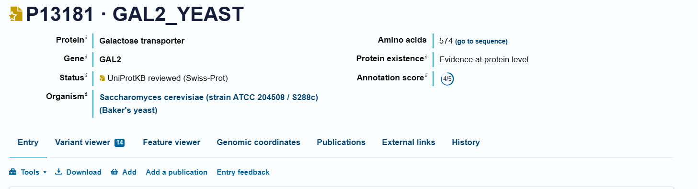
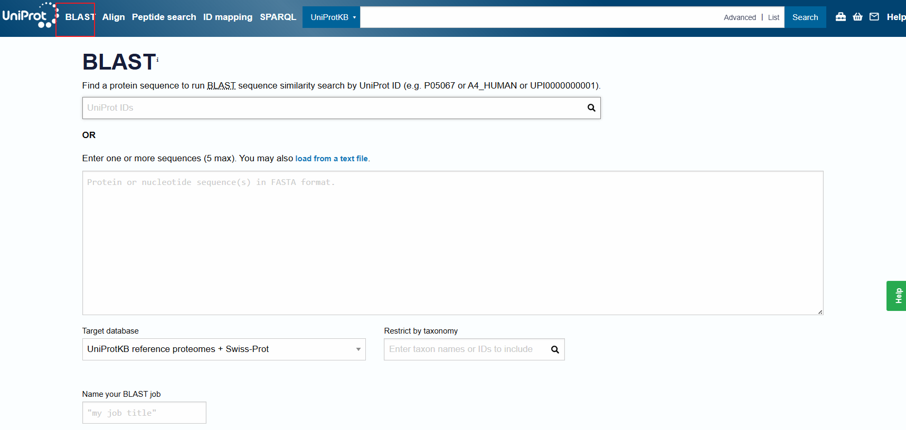

## 1. Web Resources and Databases for Proteins, Nucleic Acids, Genomes, Subcellular Pathways

### **1.1 UNIPROT (Universal Protein Resource)**

 **URL** : [https://www.uniprot.org](https://www.uniprot.org/)



* **Purpose** : Comprehensive resource for protein sequence and functional annotation.
* **Key Components** :
  * **SwissProt** : Manually reviewed, high-quality protein sequences with functional annotations.
  * **TrEMBL** : Automatically annotated protein sequences, updated frequently.
* **Features** :
  * Protein function, domains, post-translational modifications, and interaction data.
  * Supports BLAST and sequence alignment searches.
    
    

### **1.2 SWISSPROT/UniprotKB**

 **URL** : [https://www.uniprot.org](https://www.uniprot.org/) (part of UniProt)

SWISS-PROT, now commonly referred to as the **Swiss-Prot** database, is a **manually curated** database of protein sequences that provides **high-quality annotations** about proteins. It forms a core part of the UniProt Knowledgebase (UniProtKB), which is one of the most widely used resources in proteomics and bioinformatics.

* **High-Quality, Reviewed Entries:**

  * Each protein entry in Swiss-Prot is reviewed manually by biocurators who verify the sequence and provide detailed functional annotations.
  * Annotations may include protein names, function, subcellular location, biological pathways, interactions, and post-translational modifications (PTMs).
* **Experimental Validation**:

  * Swiss-Prot prioritizes data derived from experimental evidence (e.g., mass spectrometry, crystallography) to ensure that the annotations are based on proven results rather than computational predictions alone.
* **Low Redundancy:**

  * Efforts are made to avoid duplicate entries, ensuring that only unique sequences with biologically relevant differences are stored.
* **Consistent Nomenclature and Controlled Vocabulary:**

  * Swiss-Prot ensures that protein names and descriptions are standardized and follow controlled vocabulary to avoid confusion.

#### **Relationship Between Swiss-Prot and UniProt**

**UniProt** (Universal Protein Resource) is a comprehensive database that consolidates multiple protein databases, including  **Swiss-Prot** , to provide a unified platform for protein sequence and functional information. UniProt consists of three major components:

### **1.3 PDB (Protein Data Bank)**

 **URL** : [https://www.rcsb.org](https://www.rcsb.org/)

* **Purpose** : Repository of 3D structural data for biological macromolecules.
* **Key Features** :
  * Structures determined using X-ray crystallography, NMR, and cryo-electron microscopy (cryo-EM).
  * Formats: `.pdb`, `.cif`, and `.mtz` files.
* **Applications** :
  * Structure-based drug design, protein-ligand interaction analysis, and homology modeling.

### **1.4 SCOP/SCOP2 (Structural Classification of Proteins)**

 **URL** : [http://scop.mrc-lmb.cam.ac.uk](http://scop.mrc-lmb.cam.ac.uk/)

* **Purpose** : Classifies proteins hierarchically based on structural and evolutionary relationships.
* How to Use: [SCOP| Structural Classification of Proteins](https://www.ebi.ac.uk/pdbe/scop/about)
* **Hierarchy Levels** : Class → Fold → Superfamily → Family

  * Class: grouped based on their overall secondary structure composition.
    * all alpha
    * all beta
    * alpha/beta
    * alpha+beta
    * IUPR(Intrinsically Unstructured Protein Regions)
  * **Fold:** Groups superfamilies that share the same overall arrangement of secondary structures (architecture and topology)
    * Example: TIM-barrel (α/β-barrel)
  * Superfamily: A superfamily contains proteins that share structural features and likely have a common evolutionary ancestor
    * Example: **Globin superfamily** (hemoglobin, myoglobin).
  * Family: A **family** contains proteins that are **closely related** with  **high sequence similarity** .
    * These proteins often share a **common biological function** and can be identified using standard sequence alignment methods (e.g., BLAST).
    * Example: Serine protease family (trypsin, chymotrypsin).

#### Example: Hemoglobin Subunit

* **Class:** All-α proteins (predominantly α-helices).
  * **Fold:** Globin-like fold (8 α-helices arranged in a specific topology).
    * **Superfamily:** Globins (proteins involved in oxygen transport).
      * **Family:** Hemoglobin family (proteins with oxygen-binding functions).

### **1.5 CATH/GEN3D (Class, Architecture, Topology, Homologous Superfamily)**

 **URL** : [https://www.cathdb.info](https://www.cathdb.info/)

**CATH (Class, Architecture, Topology, Homology)** is a publicly available online database that classifies protein domains based on their three-dimensional structures and evolutionary relationships. It was created in the 1990s by **Professor Christine Orengo** and is maintained at  **University College London (UCL)** .

**Gene3D** complements CATH by predicting domains for proteins without experimentally determined structures using Hidden Markov Models (HMMs).

#### **Key Attributes** :

* Use domain-based classification for protein folds.
* Use for comparisons of protein architectures and homologous relationships.

> CATH 2024: CATH-AlphaFlow Doubles the Number of Structures in CATH and Reveals Nearly 200 New Folds Waman VP, Bordin N, Alcraft R, Vickerstaff R, Rauer C, Chan Q, Sillitoe I, Yamamori H, Orengo C. J Mol Biol.[Pubmed: 38548261](https://www.ncbi.nlm.nih.gov/pubmed/38548261)[doi: 10.1016/j.jmb.2024.168551](https://doi.org/10.1016/j.jmb.2024.168551)
>
> Gene3D: Extensive prediction of globular domains in proteins. Lewis TE, Sillitoe I, Dawson N, Lam SD, Clarke T, Orengo CA, Lees JG. Nucleic Acids Res. 2018 Jan [Pubmed: 29194501](https://www.ncbi.nlm.nih.gov/pubmed/29194501) [doi: 10.1093/nar/gkx1069](https://doi.org/10.1093/nar/gkx1069)

### **1.6 NCBI (National Center for Biotechnology Information)**

The **National Center for Biotechnology Information (NCBI)** is a vital hub for bioinformatics and life sciences, providing a comprehensive suite of databases and tools to support biological research. Established in **1988** as part of the  **National Library of Medicine (NLM)** , NCBI plays a crucial role in advancing understanding of molecular biology and genetics by offering access to large-scale genomic and biomedical data. 

 **URL** : [https://www.ncbi.nlm.nih.gov](https://www.ncbi.nlm.nih.gov/)

**Key Resources** :

* **GenBank** : Repository of nucleotide sequences.
* **BLAST (Basic Local Alignment Search Tool)** : For sequence similarity searches ([BLAST tool](https://blast.ncbi.nlm.nih.gov/)).
* **PubMed** : Literature resource for biomedical research articles ([PubMed](https://pubmed.ncbi.nlm.nih.gov/)).
* Additional resources:

  * RefSeq (Reference Sequence Database): A curated collection of **reference sequences** representing the standard, non-redundant data for genomes, transcripts, and proteins.
  * **dbSNP (Database of Single Nucleotide Polymorphisms):** A repository for  **genetic variation data** , including single nucleotide polymorphisms (SNPs), insertions, deletions, and microsatellites.
  * **Gene Database:** Contains detailed information on genes across various species. Includes gene function, expression, pathways, and orthologs.
  * **GEO (Gene Expression Omnibus):** A repository for **high-throughput gene expression** data, including microarray and RNA-seq datasets. Supports large-scale studies in transcriptomics and functional genomics.
  * **SRA (Sequence Read Archive):** Stores **raw sequencing data** from next-generation sequencing (NGS) experiments. Essential for large-scale projects like genome assembly, variant calling, and transcriptome analysis.
  * **ClinVar:** A database that aggregates information about **genetic variants** and their association with diseases. Provides clinical significance annotations for use in medical diagnostics and personalized medicine.

### **1.7 KEGG (Kyoto Encyclopedia of Genes and Genomes)**

The **Kyoto Encyclopedia of Genes and Genomes (KEGG)** is a comprehensive database resource for understanding biological systems, functions, and interactions at the molecular level. Established in **1995** by **Dr. Minoru Kanehisa** and maintained by the **Kanehisa Laboratories** in collaboration with the  **Kyoto University Bioinformatics Center** , KEGG integrates genomic, chemical, and systemic functional data to facilitate studies in systems biology, drug development, and translational research.

 **URL** : [https://www.genome.jp/kegg](https://www.genome.jp/kegg)

* **Purpose** : Resource for linking genomes to biological functions.
* **Key Databases** :
  * **KEGG PATHWAY** : Molecular interaction and pathway maps.
  * **KEGG GENES** : Annotated genes from various organisms.
  * **KEGG ENZYME** : Data on enzymatic functions and metabolic roles.
  * **KEGG COMPOUND and KEGG DRUG** : Databases of chemical compounds, glycans, and drugs that link molecular interactions to biochemical pathways and disease-related targets.

> Kanehisa, M. and Goto, S.; KEGG: Kyoto Encyclopedia of Genes and Genomes. Nucleic Acids Res. 28, 27-30 (2000). [[pubmed](https://pubmed.ncbi.nlm.nih.gov/10592173)] [[doi](https://doi.org/10.1093/nar/28.1.27)]
>
> Kanehisa, M; Toward understanding the origin and evolution of cellular organisms. Protein Sci. 28, 1947-1951 (2019) [[pubmed](https://pubmed.ncbi.nlm.nih.gov/31441146)] [[doi](https://doi.org/10.1002/pro.3715)]
>
> Kanehisa, M., Furumichi, M., Sato, Y., Kawashima, M. and Ishiguro-Watanabe, M.; KEGG for taxonomy-based analysis of pathways and genomes. Nucleic Acids Res. 51, D587-D592 (2023).

### **1.8 YEASTbook**

 **URL** : [https://www.yeastgenome.org](https://www.yeastgenome.org/)

* **Purpose** : Resource for research on *Saccharomyces cerevisiae* (baker’s yeast).
* Contents:

  * [Cell Cycle](https://academic.oup.com/genetics/pages/yeastbook-cell-cycle)
  * [Cell Signaling and Development](https://academic.oup.com/genetics/pages/yeastbook-cell-signaling-and-development)
  * [Cell Structure and Trafficking](https://academic.oup.com/genetics/pages/yeastbook-cell-structure-and-trafficking)
  * [Gene Expression and Metabolism](https://academic.oup.com/genetics/pages/yeastbook-gene-expression-and-metabolism)
  * [Genome Organization and Integrity](https://academic.oup.com/genetics/pages/yeastbook-genome-organization-and-integrity)
  * [Additional Articles](https://academic.oup.com/genetics/pages/yeastbook-additional-articles)

> Hinnebusch AG, Johnston M. YeastBook: an encyclopedia of the reference eukaryotic cell. Genetics. 2011 Nov;189(3):683-4. doi: 10.1534/genetics.111.135129. PMID: 22084419; PMCID: PMC3213385.

### **1.9 BRENDA (The Comprehensive Enzyme Database)**

 **URL** : [https://www.brenda-enzymes.org](https://www.brenda-enzymes.org/)

* **Purpose** : Enzyme-specific database with data on enzymatic reactions.
* **Key Features** :
  * Information on substrates, cofactors, inhibitors, and reaction kinetics.
  * Pathway data integration to support metabolic engineering and systems biology.

---

## **2. Deep Learning Neural Networks (NN)**

### **Neural Networks (NNs)** :

Deep learning architectures for biological sequence and structure analysis.

Typical layers:

* **Input Layer** : Takes biological sequence data (DNA/protein sequences).
* **Hidden Layers** : Perform computations using activation functions (ReLU, Sigmoid).
* **Output Layer** : Predicts properties (e.g., structure, binding sites).

### **Example Applications** :

#### **[AlphaFold3](https://deepmind.google/technologies/alphafold/)** : Predicts protein structures from sequences.

AlphaFold 3, developed by Isomorphic Labs Limited (London, United Kingdom) and Google DeepMind, represents a significant leap forward in the field of molecular biology through its ability to predict the structure and interactions of biomolecules with unparalleled accuracy. This revolutionary model extends its predictive capabilities beyond proteins to encompass a broad spectrum of biomolecules, **including proteins, DNA, RNA, and ligands**, thereby offering a comprehensive understanding of the biological world.

* **The Evoformer in AF2/AF3** is based on a **transformer-like neural network** that takes in two main representations:

  1. **MSA Representation (multiple sequence alignment)** – captures evolutionary conservation patterns across homologous sequences.
  2. **Pair Representation (pairwise distances)** – models spatial relationships between amino acids in the sequence.

  The Evoformer learns how amino acids interact within a protein sequence and how these interactions evolve across homologous sequences by applying attention and mixing operations to the MSA and pair representations.
* **Diffusion Module(AF3 only):** AF3 utilizes a diffusion model to generate predicted protein structures by progressively refining a noisy initial representation of atomic coordinates= , essentially "denoising" the data to arrive at a final, accurate protein structure; it replaces the previous "Structure module" used in AlphaFold 2


AF3 is pubicly available in the github repository: [google-deepmind/alphafold3: AlphaFold 3 inference pipeline.](https://github.com/google-deepmind/alphafold3) The model parameters have to be requested from Google DeepMind by [this form](https://forms.gle/svvpY4u2jsHEwWYS6) and subject to [terms of use](https://github.com/google-deepmind/alphafold3/blob/main/WEIGHTS_TERMS_OF_USE.md).

Alternatively, you can just use their server for non-commerical purpose: [AlphaFold Server - Google DeepMind](https://deepmind.google/technologies/alphafold/alphafold-server/)

> Abramson, J., Adler, J., Dunger, J. *et al.* Accurate structure prediction of biomolecular interactions with AlphaFold 3. *Nature*  **630** , 493–500 (2024). https://doi.org/10.1038/s41586-024-07487-w

### **RoseTTAFold**

RoseTTAFold is a protein structure prediction tool developed by the Baker Lab, leveraging a three-track neural network that integrates 1D sequence information, 2D distance maps, and 3D structural coordinates simultaneously. This architecture allows for iterative refinement of protein structures and has demonstrated remarkable performance in predicting single-chain folds, multi-domain proteins, and protein-protein complexes. By combining sequence and structure data at different levels, RoseTTAFold aids experimental methods like X-ray crystallography and cryo-EM, making it a valuable tool for solving previously intractable structural problems.

* Online server: [robetta.bakerlab.org](https://robetta.bakerlab.org/)
* Github repository: [RosettaCommons/RoseTTAFold: This package contains deep learning models and related scripts for RoseTTAFold](https://github.com/RosettaCommons/RoseTTAFold)

#### Variants

* [RoseTTAFold2]([uw-ipd/RoseTTAFold2](https://github.com/uw-ipd/RoseTTAFold2)) : It improves upon the original by refining 3D structures directly within the network, offering faster predictions and enabling direct modeling of protein-protein complexes without requiring external tools like docking.
* [RoseTTAFold2NA](https://github.com/uw-ipd/RoseTTAFold2NA): protein–DNA and protein–RNA complexes binding supported

> Minkyung Baek *et al*.**Accurate prediction of protein structures and interactions using a three-track neural network.** Science373,871-876(2021). DOI:[10.1126/science.abj8754](https://doi.org/10.1126/science.abj8754)
>
> Ian R. Humphreys *et al.***Computed structures of core eukaryotic protein complexes**.Science374 ,eabm4805(2021). DOI:[10.1126/science.abm4805](https://doi.org/10.1126/science.abm4805)**
>
> Baek, M., McHugh, R., Anishchenko, I. *et al.* **Accurate prediction of protein–nucleic acid complexes using RoseTTAFoldNA.** *Nat Methods*21 , 117–121 (2024). https://doi.org/10.1038/s41592-023-02086-5

#### **DeepSEA** : Predicts regulatory effects of genomic variants.

DeepSEA is a deep learning-based framework designed to predict the chromatin effects of sequence alterations at single-nucleotide resolution. It can accurately infer the epigenetic state of a sequence, including transcription factor binding, DNase I hypersensitivity, and histone modifications across various cell types. This predictive capability allows DeepSEA to assess the chromatin impact of sequence variants and prioritize regulatory variants for further analysis.

Link: [HumanBase DeepSEA](https://hb.flatironinstitute.org/deepsea/)

> Zhou, J., Troyanskaya, O. Predicting effects of noncoding variants with deep learning–based sequence model. *Nat Methods*  **12** , 931–934 (2015). https://doi.org/10.1038/nmeth.3547

**Libraries** :

* PyTorch ([https://pytorch.org](https://pytorch.org/)): roseTTAFold uses this. 
* Jax: Python library used by AF3 for accelerator-oriented array computation and program transformation, designed for high-performance numerical computing and large-scale machine learning.([JAX: High performance array computing — JAX documentation](https://jax.readthedocs.io/en/latest/))

---

## **3. Sequence/Structure Alignment Algorithms**

### **3.1 Smith-Waterman Algorithm**

 **Purpose** : Performs local sequence alignment.

* **Characteristics** :
* Uses dynamic programming to find the best local alignment.
* Works with substitution matrices (e.g., BLOSUM, PAM) to score matches.
* Particularly useful for detecting conserved motifs within large sequences.

 **References** :

* Smith-Waterman (original publication): [DOI link](https://doi.org/10.1016/0022-2836(81)90087-5)

### **3.2 STAMP (Structural Alignment of Multiple Proteins)**

 **URL** : [https://www.compbio.dundee.ac.uk/manuals/stamp](https://www.compbio.dundee.ac.uk/manuals/stamp)

* **Purpose** : Aligns protein structures based on 3D conformation.
* **Applications** :
* Identifies structural similarities and evolutionary conservation.
* Provides superposition files for visualization.

---

## **4. Visualization Tools**

### **4.1 VMD (Visual Molecular Dynamics)**

 **URL** : [https://www.ks.uiuc.edu/Research/vmd](https://www.ks.uiuc.edu/Research/vmd)

* **Purpose** : A molecular visualization program used for viewing molecular dynamics simulations.
* **Key Features** :
* Reads `.pdb`, `.gro`, and simulation trajectory files.
* Can display molecular surfaces, secondary structures, and molecular bonds.
* **Uses** :
* Visualization of protein-ligand interactions.
* Rendering of molecular movies for presentations.

### **4.2 MultiSeq (VMD Extension)**

* **Purpose** : An extension for VMD that enables sequence and structure alignments.
* **Features** :
* Generates conservation maps from aligned structures.
* Helps visualize evolutionary patterns and functional sites.

---

## **5. Biopython (Python Library for Bioinformatics)**

 **URL** : [https://biopython.org](https://biopython.org/)

* **Purpose** : Provides tools for handling biological data in Python.
* **Key Functionalities** :
* **Sequence Parsing** : Read/write sequence files (.fasta, .genbank).
* **PDB Parser** : Extract atomic coordinates from PDB files for downstream analysis.
* **Alignment** : Perform pairwise and multiple sequence alignments programmatically.

 **Code Example** :

```python
from Bio import SeqIO

# Reading a FASTA file
for seq_record in SeqIO.parse("example.fasta", "fasta"):
    print(f"ID: {seq_record.id}")
    print(f"Sequence: {seq_record.seq}")
```

---

## **Conclusion**

These web resources, databases, and algorithms form the foundation for computational analysis of protein and nucleotide sequences, structural modeling, and biological pathway analysis. Visualization tools like VMD enhance understanding of macromolecular structures, while programming libraries like Biopython enable reproducible, automated workflows.
