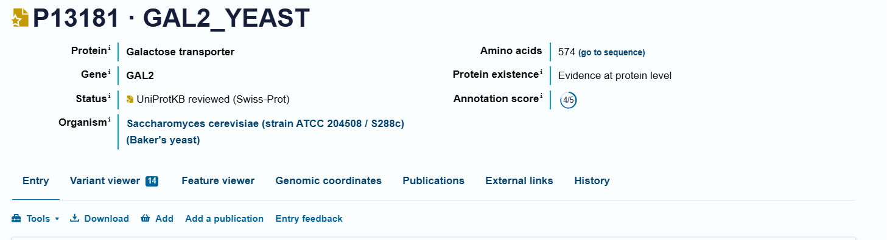
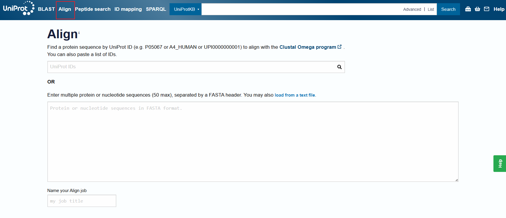
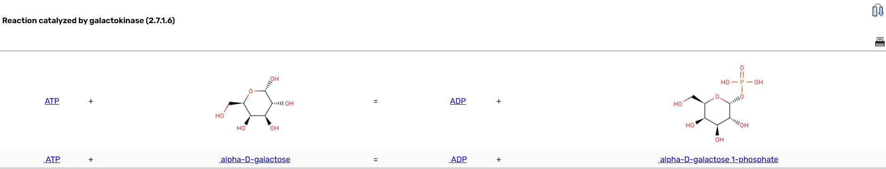
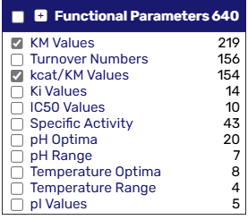
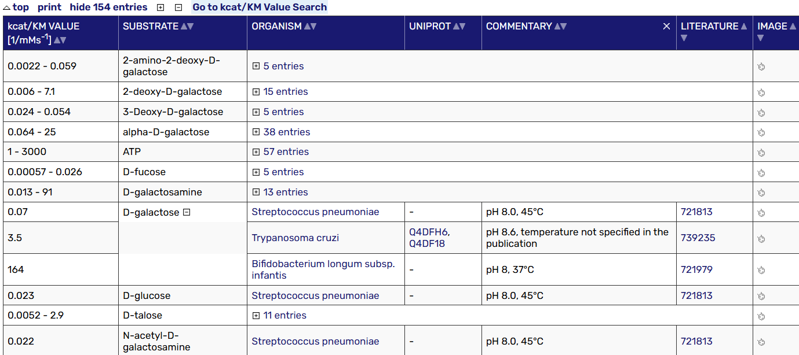
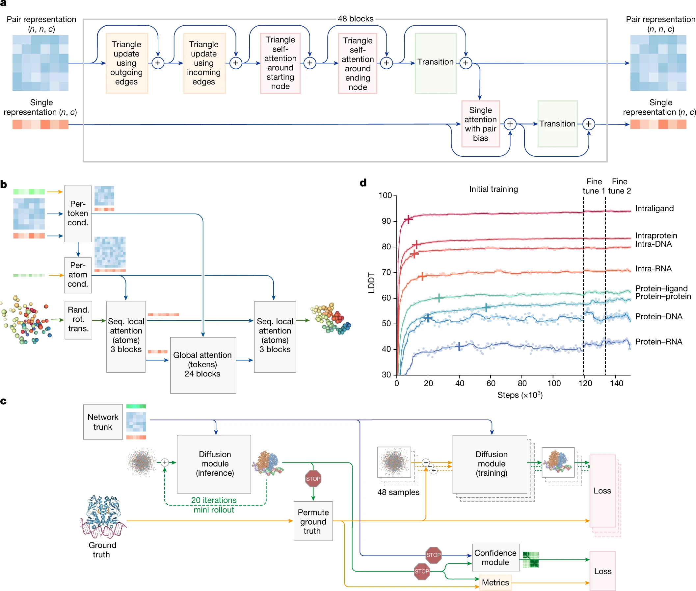

## 1. Web Resources and Databases for Proteins, Nucleic Acids, Genomes, Subcellular Pathways

### **1.1 UNIPROT (Universal Protein Resource)**

 **URL** : [https://www.uniprot.org](https://www.uniprot.org/)



* **Purpose** : Comprehensive resource for protein sequence and functional annotation.
* **Key Components** :
  * **SwissProt** : Manually reviewed, high-quality protein sequences with functional annotations.
  * **TrEMBL** : Automatically annotated protein sequences, updated frequently.
* **Features** :
  * Protein function, domains, post-translational modifications, and interaction data.
  * Supports BLAST and sequence alignment searches.
    
    

### **1.2 SWISSPROT/UniprotKB**

 **URL** : [https://www.uniprot.org](https://www.uniprot.org/) (part of UniProt)

SWISS-PROT, now commonly referred to as the **Swiss-Prot** database, is a **manually curated** database of protein sequences that provides **high-quality annotations** about proteins. It forms a core part of the UniProt Knowledgebase (UniProtKB), which is one of the most widely used resources in proteomics and bioinformatics.

* **High-Quality, Reviewed Entries:**

  * Each protein entry in Swiss-Prot is reviewed manually by biocurators who verify the sequence and provide detailed functional annotations.
  * Annotations may include protein names, function, subcellular location, biological pathways, interactions, and post-translational modifications (PTMs).
* **Experimental Validation**:

  * Swiss-Prot prioritizes data derived from experimental evidence (e.g., mass spectrometry, crystallography) to ensure that the annotations are based on proven results rather than computational predictions alone.
* **Low Redundancy:**

  * Efforts are made to avoid duplicate entries, ensuring that only unique sequences with biologically relevant differences are stored.
* **Consistent Nomenclature and Controlled Vocabulary:**

  * Swiss-Prot ensures that protein names and descriptions are standardized and follow controlled vocabulary to avoid confusion.

#### **Relationship Between Swiss-Prot and UniProt**

**UniProt** (Universal Protein Resource) is a comprehensive database that consolidates multiple protein databases, including  **Swiss-Prot** , to provide a unified platform for protein sequence and functional information. UniProt consists of three major components:

### **1.3 PDB (Protein Data Bank)**

 **URL** : [https://www.rcsb.org](https://www.rcsb.org/)

* **Purpose** : Repository of 3D structural data for biological macromolecules.
* **Key Features** :
  * Structures determined using X-ray crystallography, NMR, and cryo-electron microscopy (cryo-EM).
  * Formats: `.pdb`, `.cif`, and `.mtz` files.
* **Applications** :
  * Structure-based drug design, protein-ligand interaction analysis, and homology modeling.

### **1.4 SCOP/SCOP2 (Structural Classification of Proteins)**

 **URL** : [http://scop.mrc-lmb.cam.ac.uk](http://scop.mrc-lmb.cam.ac.uk/)

* **Purpose** : Classifies proteins hierarchically based on structural and evolutionary relationships.
* How to Use: [SCOP| Structural Classification of Proteins](https://www.ebi.ac.uk/pdbe/scop/about)
* **Hierarchy Levels** : Class → Fold → Superfamily → Family

  * Class: grouped based on their overall secondary structure composition.
    * all alpha
    * all beta
    * alpha/beta
    * alpha+beta
    * IUPR(Intrinsically Unstructured Protein Regions)
  * **Fold:** Groups superfamilies that share the same overall arrangement of secondary structures (architecture and topology)
    * Example: TIM-barrel (α/β-barrel)
  * Superfamily: A superfamily contains proteins that share structural features and likely have a common evolutionary ancestor
    * Example: **Globin superfamily** (hemoglobin, myoglobin).
  * Family: A **family** contains proteins that are **closely related** with  **high sequence similarity** .
    * These proteins often share a **common biological function** and can be identified using standard sequence alignment methods (e.g., BLAST).
    * Example: Serine protease family (trypsin, chymotrypsin).

#### Example: Hemoglobin Subunit

* **Class:** All-α proteins (predominantly α-helices).
  * **Fold:** Globin-like fold (8 α-helices arranged in a specific topology).
    * **Superfamily:** Globins (proteins involved in oxygen transport).
      * **Family:** Hemoglobin family (proteins with oxygen-binding functions).

### **1.5 CATH/GEN3D (Class, Architecture, Topology, Homologous Superfamily)**

 **URL** : [https://www.cathdb.info](https://www.cathdb.info/)

**CATH (Class, Architecture, Topology, Homology)** is a publicly available online database that classifies protein domains based on their three-dimensional structures and evolutionary relationships. It was created in the 1990s by **Professor Christine Orengo** and is maintained at  **University College London (UCL)** .

**Gene3D** complements CATH by predicting domains for proteins without experimentally determined structures using Hidden Markov Models (HMMs).

#### **Key Attributes** :

* Use domain-based classification for protein folds.
* Use for comparisons of protein architectures and homologous relationships.

> CATH 2024: CATH-AlphaFlow Doubles the Number of Structures in CATH and Reveals Nearly 200 New Folds Waman VP, Bordin N, Alcraft R, Vickerstaff R, Rauer C, Chan Q, Sillitoe I, Yamamori H, Orengo C. J Mol Biol.[Pubmed: 38548261](https://www.ncbi.nlm.nih.gov/pubmed/38548261)[doi: 10.1016/j.jmb.2024.168551](https://doi.org/10.1016/j.jmb.2024.168551)
>
> Gene3D: Extensive prediction of globular domains in proteins. Lewis TE, Sillitoe I, Dawson N, Lam SD, Clarke T, Orengo CA, Lees JG. Nucleic Acids Res. 2018 Jan [Pubmed: 29194501](https://www.ncbi.nlm.nih.gov/pubmed/29194501) [doi: 10.1093/nar/gkx1069](https://doi.org/10.1093/nar/gkx1069)

### **1.6 NCBI (National Center for Biotechnology Information)**

The **National Center for Biotechnology Information (NCBI)** is a vital hub for bioinformatics and life sciences, providing a comprehensive suite of databases and tools to support biological research. Established in **1988** as part of the  **National Library of Medicine (NLM)** , NCBI plays a crucial role in advancing understanding of molecular biology and genetics by offering access to large-scale genomic and biomedical data.

 **URL** : [https://www.ncbi.nlm.nih.gov](https://www.ncbi.nlm.nih.gov/)

**Key Resources** :

* **GenBank** : Repository of nucleotide sequences.
* **BLAST (Basic Local Alignment Search Tool)** : For sequence similarity searches ([BLAST tool](https://blast.ncbi.nlm.nih.gov/)).
* **PubMed** : Literature resource for biomedical research articles ([PubMed](https://pubmed.ncbi.nlm.nih.gov/)).
* Additional resources:

  * RefSeq (Reference Sequence Database): A curated collection of **reference sequences** representing the standard, non-redundant data for genomes, transcripts, and proteins.
  * **dbSNP (Database of Single Nucleotide Polymorphisms):** A repository for  **genetic variation data** , including single nucleotide polymorphisms (SNPs), insertions, deletions, and microsatellites.
  * **Gene Database:** Contains detailed information on genes across various species. Includes gene function, expression, pathways, and orthologs.
  * **GEO (Gene Expression Omnibus):** A repository for **high-throughput gene expression** data, including microarray and RNA-seq datasets. Supports large-scale studies in transcriptomics and functional genomics.
  * **SRA (Sequence Read Archive):** Stores **raw sequencing data** from next-generation sequencing (NGS) experiments. Essential for large-scale projects like genome assembly, variant calling, and transcriptome analysis.
  * **ClinVar:** A database that aggregates information about **genetic variants** and their association with diseases. Provides clinical significance annotations for use in medical diagnostics and personalized medicine.

### **1.7 KEGG (Kyoto Encyclopedia of Genes and Genomes)**

The **Kyoto Encyclopedia of Genes and Genomes (KEGG)** is a comprehensive database resource for understanding biological systems, functions, and interactions at the molecular level. Established in **1995** by **Dr. Minoru Kanehisa** and maintained by the **Kanehisa Laboratories** in collaboration with the  **Kyoto University Bioinformatics Center** , KEGG integrates genomic, chemical, and systemic functional data to facilitate studies in systems biology, drug development, and translational research.

 **URL** : [https://www.genome.jp/kegg](https://www.genome.jp/kegg)

* **Purpose** : Resource for linking genomes to biological functions.
* **Key Databases** :
  * **KEGG PATHWAY** : Molecular interaction and pathway maps.
  * **KEGG GENES** : Annotated genes from various organisms.
  * **KEGG ENZYME** : Data on enzymatic functions and metabolic roles.
  * **KEGG COMPOUND and KEGG DRUG** : Databases of chemical compounds, glycans, and drugs that link molecular interactions to biochemical pathways and disease-related targets.

> Kanehisa, M. and Goto, S.; KEGG: Kyoto Encyclopedia of Genes and Genomes. Nucleic Acids Res. 28, 27-30 (2000). [[pubmed](https://pubmed.ncbi.nlm.nih.gov/10592173)] [[doi](https://doi.org/10.1093/nar/28.1.27)]
>
> Kanehisa, M; Toward understanding the origin and evolution of cellular organisms. Protein Sci. 28, 1947-1951 (2019) [[pubmed](https://pubmed.ncbi.nlm.nih.gov/31441146)] [[doi](https://doi.org/10.1002/pro.3715)]
>
> Kanehisa, M., Furumichi, M., Sato, Y., Kawashima, M. and Ishiguro-Watanabe, M.; KEGG for taxonomy-based analysis of pathways and genomes. Nucleic Acids Res. 51, D587-D592 (2023).

### **1.8 YEASTbook**

 **URL** : [https://www.yeastgenome.org](https://www.yeastgenome.org/)

* **Purpose** : Resource for research on *Saccharomyces cerevisiae* (baker’s yeast).
* Contents:

  * [Cell Cycle](https://academic.oup.com/genetics/pages/yeastbook-cell-cycle)
  * [Cell Signaling and Development](https://academic.oup.com/genetics/pages/yeastbook-cell-signaling-and-development)
  * [Cell Structure and Trafficking](https://academic.oup.com/genetics/pages/yeastbook-cell-structure-and-trafficking)
  * [Gene Expression and Metabolism](https://academic.oup.com/genetics/pages/yeastbook-gene-expression-and-metabolism)
  * [Genome Organization and Integrity](https://academic.oup.com/genetics/pages/yeastbook-genome-organization-and-integrity)
  * [Additional Articles](https://academic.oup.com/genetics/pages/yeastbook-additional-articles)

> Hinnebusch AG, Johnston M. YeastBook: an encyclopedia of the reference eukaryotic cell. Genetics. 2011 Nov;189(3):683-4. doi: 10.1534/genetics.111.135129. PMID: 22084419; PMCID: PMC3213385.

### **1.9 BRENDA (The Comprehensive Enzyme Database)**

BRENDA (The Comprehensive Enzyme Information System) is the world's largest and most detailed repository of enzyme functional data, freely accessible online. Established in 1987, BRENDA has evolved into an essential tool for researchers in molecular biology, biochemistry, and related fields. The database aggregates enzyme-related data from scientific literature, providing a centralized resource for studying enzyme activity, regulation, and metabolic roles. By classifying enzymes according to the Enzyme Commission (EC) system, BRENDA helps interpret genome data and facilitates applications in areas like medicine, agriculture, and biotechnology.

 **URL** : [https://www.brenda-enzymes.org](https://www.brenda-enzymes.org/)

* **Purpose** : Enzyme-specific database with data on enzymatic reactions.
* **Key Features** :

  * Information on substrates, cofactors, inhibitors, and reaction kinetics.
  * Pathway data integration to support metabolic engineering and systems biology.

#### Example: Gal1/Gal1p/galactokinase/EC 2.7.1.6




select the functional group you want:





---

## **2. Deep Learning Neural Networks (NN)**

### **2.1Neural Networks (NNs)** :

Deep learning architectures for biological sequence and structure analysis.

Typical layers:

* **Input Layer** : Takes biological sequence data (DNA/protein sequences).
* **Hidden Layers** : Perform computations using activation functions (ReLU, Sigmoid).
* **Output Layer** : Predicts properties (e.g., structure, binding sites).

### **2.2Example Applications** :

#### **[AlphaFold3](https://deepmind.google/technologies/alphafold/)** : Predicts protein structures from sequences.

AlphaFold 3, developed by Isomorphic Labs Limited (London, United Kingdom) and Google DeepMind, represents a significant leap forward in the field of molecular biology through its ability to predict the structure and interactions of biomolecules with unparalleled accuracy. This revolutionary model extends its predictive capabilities beyond proteins to encompass a broad spectrum of biomolecules, **including proteins, DNA, RNA, and ligands**, thereby offering a comprehensive understanding of the biological world.

* **The Evoformer in AF2/AF3** is based on a **transformer-like neural network** that takes in two main representations:

  1. **MSA Representation (multiple sequence alignment)** – captures evolutionary conservation patterns across homologous sequences.
  2. **Pair Representation (pairwise distances)** – models spatial relationships between amino acids in the sequence.

  The Evoformer learns how amino acids interact within a protein sequence and how these interactions evolve across homologous sequences by applying attention and mixing operations to the MSA and pair representations.
* **Diffusion Module(AF3 only):** AF3 utilizes a diffusion model to generate predicted protein structures by progressively refining a noisy initial representation of atomic coordinates= , essentially "denoising" the data to arrive at a final, accurate protein structure; it replaces the previous "Structure module" used in AlphaFold 2



AF3 is pubicly available in the github repository: [google-deepmind/alphafold3: AlphaFold 3 inference pipeline.](https://github.com/google-deepmind/alphafold3) The model parameters have to be requested from Google DeepMind by [this form](https://forms.gle/svvpY4u2jsHEwWYS6) and subject to [terms of use](https://github.com/google-deepmind/alphafold3/blob/main/WEIGHTS_TERMS_OF_USE.md).

Alternatively, you can just use their server for non-commerical purpose: [AlphaFold Server - Google DeepMind](https://deepmind.google/technologies/alphafold/alphafold-server/)

> Abramson, J., Adler, J., Dunger, J. *et al.* Accurate structure prediction of biomolecular interactions with AlphaFold 3. *Nature*  **630** , 493–500 (2024). https://doi.org/10.1038/s41586-024-07487-w

### **RoseTTAFold**

RoseTTAFold is a protein structure prediction tool developed by the Baker Lab, leveraging a three-track neural network that integrates 1D sequence information, 2D distance maps, and 3D structural coordinates simultaneously. This architecture allows for iterative refinement of protein structures and has demonstrated remarkable performance in predicting single-chain folds, multi-domain proteins, and protein-protein complexes. By combining sequence and structure data at different levels, RoseTTAFold aids experimental methods like X-ray crystallography and cryo-EM, making it a valuable tool for solving previously intractable structural problems.

* Online server: [robetta.bakerlab.org](https://robetta.bakerlab.org/)
* Github repository: [RosettaCommons/RoseTTAFold: This package contains deep learning models and related scripts for RoseTTAFold](https://github.com/RosettaCommons/RoseTTAFold)

#### Variants

* [RoseTTAFold2]([uw-ipd/RoseTTAFold2](https://github.com/uw-ipd/RoseTTAFold2)) : It improves upon the original by refining 3D structures directly within the network, offering faster predictions and enabling direct modeling of protein-protein complexes without requiring external tools like docking.
* [RoseTTAFold2NA](https://github.com/uw-ipd/RoseTTAFold2NA): protein–DNA and protein–RNA complexes binding supported

> Minkyung Baek *et al*.**Accurate prediction of protein structures and interactions using a three-track neural network.** Science373,871-876(2021). DOI:[10.1126/science.abj8754](https://doi.org/10.1126/science.abj8754)
>
> Ian R. Humphreys *et al.***Computed structures of core eukaryotic protein complexes**.Science374 ,eabm4805(2021). DOI:[10.1126/science.abm4805](https://doi.org/10.1126/science.abm4805)**
>
> Baek, M., McHugh, R., Anishchenko, I. *et al.* **Accurate prediction of protein–nucleic acid complexes using RoseTTAFoldNA.** *Nat Methods*21 , 117–121 (2024). https://doi.org/10.1038/s41592-023-02086-5

### **2.3 DeepSEA** : Predicts regulatory effects of genomic variants.

DeepSEA is a deep learning-based framework designed to predict the chromatin effects of sequence alterations at single-nucleotide resolution. It can accurately infer the epigenetic state of a sequence, including transcription factor binding, DNase I hypersensitivity, and histone modifications across various cell types. This predictive capability allows DeepSEA to assess the chromatin impact of sequence variants and prioritize regulatory variants for further analysis.

Link: [HumanBase DeepSEA](https://hb.flatironinstitute.org/deepsea/)

> Zhou, J., Troyanskaya, O. Predicting effects of noncoding variants with deep learning–based sequence model. *Nat Methods*  **12** , 931–934 (2015). https://doi.org/10.1038/nmeth.3547

**Libraries** :

* PyTorch ([https://pytorch.org](https://pytorch.org/)): roseTTAFold uses this.
* Jax: Python library used by AF3 for accelerator-oriented array computation and program transformation, designed for high-performance numerical computing and large-scale machine learning.([JAX: High performance array computing — JAX documentation](https://jax.readthedocs.io/en/latest/))

---

## **3. Sequence/Structure Alignment Algorithms**

### 3.1. **Sequence Alignment**

Sequence alignment is the process of arranging the sequences of nucleotides (DNA or RNA) or amino acids (proteins) to identify regions of similarity that may be a consequence of structural, functional, or evolutionary relationships.

Formally, given two sequences $A = (a_1, a_2, \ldots, a_m) $ and $B = (b_1, b_2, \ldots, b_n) $ over an alphabet (e.g., $\Sigma = \{A, C, G, T\}$ for nucleotides or 20 amino acids for proteins), a sequence alignment is a set of pairs of indices $(i, j) $ such that:

* Each index $i$ corresponds to a character in $A$, and $j$ corresponds to a character in $B$.
* Each character can appear in at most one pair in the alignment.
* The order is preserved: If $(i, j)$ and $(i', j')$ are pairs in the alignment and $i < i'$, then $j < j'$.

#### 3.1.1Scoring Function:

The alignment is evaluated based on a scoring function $S(A, B)$, which typically includes:

* $\delta(a_i, b_j)$: A substitution matrix (e.g., BLOSUM or PAM for proteins) that assigns a score to matching or mismatching pairs.
* $g(k)$: A gap penalty function that penalizes insertions or deletions in the sequence.

The optimal alignment maximizes the score:

$$
\text{Score} = \sum_{(i,j) \in \text{alignment}} \delta(a_i, b_j) - \sum_{\text{gaps}} g(k)
$$

Types of Sequence Alignments:

* **Global alignment** (e.g., Needleman-Wunsch): Aligns the entire length of both sequences.
* **Local alignment** (e.g., Smith-Waterman): Identifies the highest-scoring subsequences.

#### 3.1.2 Global Alighment(Needleman-Wunsch) Algorithm

##### Definitions:

- Let $A = a_1, a_2, \ldots, a_m$ and $B = b_1, b_2, \ldots, b_n$ be two sequences of length $m$ and $n$.
- Define $S(i, j)$ as the **alignment score** of sequences $A$ and $B$ up to $i$\-th and $j$\-th elements, respectively.
- Let:
  - $\text{match}(a_i, b_j)$ = score for matching $a_i$ and $b_j$,
  - $\text{mismatch penalty} = -\mu$,
  - $\text{gap penalty} = -\delta$ for inserting a gap.

**Recursive Formula for the Score Matrix $S(i, j)$:**

$S(i, j) = \max \begin{cases} S(i - 1, j - 1) + \text{score}(a_i, b_j) & \text{(diagonal: match/mismatch)} \\ S(i - 1, j) - \delta & \text{(vertical: gap in sequence B)} \\ S(i, j - 1) - \delta & \text{(horizontal: gap in sequence A)} \end{cases}$

**Boundary Conditions:**

$S(0, 0) = 0, \quad S(i, 0) = -i \cdot \delta, \quad S(0, j) = -j \cdot \delta$

This initializes the first row and column to reflect the cost of gaps.

---

##### **Step-by-Step Example**

- Sequence $A = \text{"GATT"}$
- Sequence $B = \text{"GCTA"}$
- Scoring:

  - Match = $+1$,
  - Mismatch = $-1$,
  - Gap penalty $\delta = -2$.

**Step 1: Initialization of the Matrix**

We create a matrix $S(i, j)$ of size $(m + 1) \times (n + 1)$, initialized as follows:

$\begin{array}{c|c|c|c|c|c} & - & G & C & T & A \\ \hline - & 0 & -2 & -4 & -6 & -8 \\ G & -2 & & & & \\ A & -4 & & & & \\ T & -6 & & & & \\ T & -8 & & & & \\ \end{array}$

**Step 2: Filling the Matrix**

We compute the values using the recursive formula:

1. **Cell (1, 1): $S(1, 1)$**

   - Sequence positions: $A[1] = \text{G}, B[1] = \text{G}$
   - $\text{match}(G, G) = +1$

   $S(1, 1) = \max \begin{cases} S(0, 0) + 1 = 0 + 1 = 1 \quad \text{(match)} \\ S(0, 1) - 2 = -2 - 2 = -4 \quad \text{(gap in A)} \\ S(1, 0) - 2 = -2 - 2 = -4 \quad \text{(gap in B)} \end{cases} = 1$
2. **Cell (1, 2): $S(1, 2)$**

   - Sequence positions: $A[1] = \text{G}, B[2] = \text{C}$
   - $\text{mismatch penalty} = -1$

   $S(1, 2) = \max \begin{cases} S(0, 1) - 1 = -2 - 1 = -3 \quad \text{(mismatch)} \\ S(0, 2) - 2 = -4 - 2 = -6 \quad \text{(gap in A)} \\ S(1, 1) - 2 = 1 - 2 = -1 \quad \text{(gap in B)} \end{cases} = -1$
3. **Continue filling the rest of the matrix similarly.**

**Final Score Matrix:**

$\begin{array}{c|c|c|c|c|c} & - & G & C & T & A \\ \hline - & 0 & -2 & -4 & -6 & -8 \\ G & -2 & 1 & -1 & -3 & -5 \\ A & -4 & -1 & 0 & -2 & 0 \\ T & -6 & -3 & -2 & 1 & -1 \\ T & -8 & -5 & -4 & -1 & 0 \\ \end{array}$

---

**Step 3: Traceback**

To get the optimal alignment, we start from $S(m, n)$ and trace backward:

1. If $S(i, j) = S(i - 1, j - 1) + \text{score}(a_i, b_j)$, align $a_i$ with $b_j$.
2. If $S(i, j) = S(i - 1, j) - \delta$, align $a_i$ with a gap.
3. If $S(i, j) = S(i, j - 1) - \delta$, align $b_j$ with a gap.

For this example:

- $G$ aligns with $G$,
- Gap inserted in $A$ at position 2,
- $T$ aligns with $T$,
- $T$ aligns with gap.

**Final Alignment:**

```python
G A - T T
G - C T A
```

---

#### **3.1.3 Local Alighment/Smith-Waterman Algorithm**

The **local alignment algorithm** is used to find the optimal subsequence alignment between two sequences by maximizing the alignment score in a subregion rather than over the entire sequences.

##### Definition

Let $A = a_1, a_2, \ldots, a_m$ and $B = b_1, b_2, \ldots, b_n$ be two sequences of lengths $m$ and $n$, respectively. Intialize the scoring matrix with:

$$
H(i, 0)= 0; H(0,j)=0
$$

The local alignment algorithm computes an **alignment score matrix** $H(i, j)$ with the following recurrence relation:

$$
H(i, j) = \max \begin{cases} 0, \\ H(i-1, j-1) + S(a_i, b_j), & \text{(match or mismatch)}, \\ H(i-1, j) + d, & \text{(deletion)}, \\ H(i, j-1) + d, & \text{(insertion)}, \end{cases}
$$

where:

- $S(a_i, b_j)$ is the score for matching $a_i$ and $b_j$ (e.g., $+2$ for match, $-1$ for mismatch).
- $d$ is the penalty for a gap (e.g., $-2$).

---

##### **Key Steps**

1. **Initialization**:

   - Set the first row and the first column to 0: $H(i, 0) = 0$ and $H(0, j) = 0$ for all $i, j$.
2. **Filling the Matrix**:

   - Compute the score for each cell $H(i, j)$ using the recurrence relation.
3. **Traceback**:

   - Find the cell with the **maximum value** in the matrix $H(i, j)$.
   - Trace back from this cell until you reach a cell with 0, collecting the optimal local alignment.
4. **Result**:

   - The score at the maximum value cell is the score of the optimal local alignment.
   - The corresponding path shows the aligned subsequences.

---

##### **Step-by-Step Example**

**Sequences**

- $A = \text{"GATTACA"}$
- $B = \text{"GCATGCU"}$

**Scoring Scheme**

- Match $S(a_i, b_j) = +2$
- Mismatch $S(a_i, b_j) = -1$
- Gap penalty $d = -2$

**1\. Initialize the Matrix**

We create an $8 \times 8$ matrix (since the lengths of $A$ and $B$ are 7 and 7, respectively), with the first row and column initialized to 0:

$\begin{array}{c|c|c|c|c|c|c|c|c} & & G & C & A & T & G & C & U \\ \hline 0 & 0 & 0 & 0 & 0 & 0 & 0 & 0 & 0 \\ G & 0 & & & & & & & \\ A & 0 & & & & & & & \\ T & 0 & & & & & & & \\ T & 0 & & & & & & & \\ A & 0 & & & & & & & \\ C & 0 & & & & & & & \\ A & 0 & & & & & & & \\ \end{array}$

---

**2\. Fill the Matrix**

We compute each cell $H(i, j)$ by comparing the three possible choices (match/mismatch, gap in $A$, or gap in $B$), always taking the maximum value (or 0 if negative):

**First few computations**:

- $H(1, 1) = \max(0, H(0, 0) + S(G, G), H(0, 1) + d, H(1, 0) + d) = \max(0, 0 + 2, 0 - 2, 0 - 2) = 2$
- $H(1, 2) = \max(0, H(0, 1) + S(G, C), H(0, 2) + d, H(1, 1) + d) = \max(0, 0 - 1, 0 - 2, 2 - 2) = 0$
- Repeat similarly for each $(i, j)$.

---

**3\. Final Matrix**

After filling the matrix, we get:

$\begin{array}{c|c|c|c|c|c|c|c|c} & & G & C & A & T & G & C & U \\ \hline 0 & 0 & 0 & 0 & 0 & 0 & 0 & 0 & 0 \\ G & 0 & 2 & 0 & 0 & 0 & 2 & 0 & 0 \\ A & 0 & 0 & 0 & 4 & 2 & 0 & 0 & 0 \\ T & 0 & 0 & 0 & 2 & 6 & 4 & 2 & 0 \\ T & 0 & 0 & 0 & 0 & 4 & 5 & 3 & 1 \\ A & 0 & 0 & 0 & 4 & 2 & 3 & 1 & 0 \\ C & 0 & 0 & 2 & 2 & 0 & 1 & 3 & 1 \\ A & 0 & 0 & 0 & 4 & 2 & 0 & 1 & 2 \\ \end{array}$

---

**4\. Traceback**

- The maximum value in the matrix is **6** at position $(4, 4)$.
- We trace back to the first 0, yielding the aligned subsequences: $A = \text{"TACA"}$ $B = \text{"TACG"}$

---

**Conclusion**

The optimal local alignment score is **6**, corresponding to the aligned subsequences `"TAC"` (from both sequences) with the maximum local similarity.

---

#### Comparison between SW and NW algorithm

|                | Smith–Waterman algorithm                               |                        Needleman–Wunsch algorithm                        |
| -------------- | ------------------------------------------------------- | :------------------------------------------------------------------------: |
| Initialization | First row and first column are set to 0                 |           First row and first column are subject to gap penalty           |
| Scoring        | Negative score is set to 0                              |                           Score can be negative                           |
| Traceback      | Begin with the highest score, end when 0 is encountered | Begin with the cell at the lower right of the matrix, end at top left cell |

#### 3.1.4 MSA(Multi-Sequence Alignment)

##### Definition

Given $m$ sequences $S_i, i = 1, \cdots, m$, the sequence set $S$ can be expressed as:

$$
S := \begin{cases}
S_1 = (S_{11}, S_{12}, \cdots, S_{1n_1}) \\
S_2 = (S_{21}, S_{22}, \cdots, S_{2n_2}) \\
\vdots \\
S_m = (S_{m1}, S_{m2}, \cdots, S_{mn_m}) \\
\end{cases}
$$

A multiple sequence alignment (MSA) is generated from this set of sequences $S$ by inserting gaps (denoted by “-”) into each $S_i$ until all modified sequences $S_i'$ have the same length $L$ such that:

$$
L \geq \max \{ n_i \mid i = 1, \cdots, m \}
$$

Additionally, no column in the aligned sequence set $S'$ should contain only gaps.

The MSA form of the sequence set $S$ is represented as:

$$
S' := \begin{cases}
S_1' = (S_{11}', S_{12}', \cdots, S_{1L}') \\
S_2' = (S_{21}', S_{22}', \cdots, S_{2L}') \\
\vdots \\
S_m' = (S_{m1}', S_{m2}', \cdots, S_{mL}') \\
\end{cases}
$$

To recover the original sequences $S_i$ from $S_i'$, all gaps are removed.

---

##### Example of MSA using a multiseq algorithm

Input Sequences:

1. **Sequence 1**: `ACGTGCA`
2. **Sequence 2**: `ACTGGA`
3. **Sequence 3**: `ACGTC`

The sequences are aligned as follows with some MSA algorithm:

Sequence 1: ACGTGCA
Sequence 2: AC-TGGA
Sequence 3: ACGT-C-

---

### 3.2. **Structural Alignment**

Structural alignment involves aligning two or more 3D structures of biomolecules (typically proteins or RNA) to identify spatial correspondences that reveal similarities in their 3D conformations, despite potential differences in sequence.

Formally, given two biomolecular structures $P = (p_1, p_2, \ldots, p_m) $ and $Q = (q_1, q_2, \ldots, q_n)$, where $p_i $ and $q_j $ represent the 3D coordinates of atoms (e.g., $C\alpha$ atoms for proteins):

* A structural alignment is a mapping $f : \{1, 2, \ldots, m\} \to \{1, 2, \ldots, n\}$ that pairs residues $p_i$ and $q_{f(i)}$.
* The alignment maximizes the spatial superposition of aligned atoms or residues while minimizing a predefined geometric distance metric.

#### 3.2.2 RMSD (Root Mean Square Deviation):

The quality of the structural alignment is typically quantified by the RMSD:

$$
\text{RMSD} = \sqrt{\frac{1}{k} \sum_{i=1}^{k} \| p_i - q_{f(i)} \|^2 }
$$

where $k$ is the number of aligned pairs, and $\| \cdot \|$ denotes the Euclidean norm.

#### Scoring Function:

An optimal structural alignment maximizes the number of aligned residues or minimizes the RMSD under allowed structural distortions, including:

* **Rigid-body transformations** : Translation and rotation.
* **Flexible alignments** : Incorporate local structural flexibility (e.g., hinge motions).

Common algorithms for structural alignment include:

* **DALI** (Distance Alignment Matrix)
* **CE** (Combinatorial Extension)
* **TM-align** (Template Modeling Alignment).

#### **3.2.3 STAMP (Structural Alignment of Multiple Proteins)**

 **URL** : [https://www.compbio.dundee.ac.uk/manuals/stamp.4.4/stamp.html](https://www.compbio.dundee.ac.uk/manuals/stamp.4.4/stamp.html)

[STAMP](http://www.compbio.dundee.ac.uk/software.html#3Dstructure) is a package for the alignment of protein sequences based on three-dimensional (3D) structure. It provides not only multiple alignments and the corresponding `best-fit’ superimpositions, but also a systematic and reproducible method for assessing the quality of such alignments. It also provides a method for protein 3D structure data base scanning. In addition to structure comparison, the STAMP package provides input for programs to display and analyse protein sequence alignments and tertiary structures.

> Proteins. 1992 Oct;14(2):309-23. [Multiple protein sequence alignment from tertiary structure comparison: assignment of global and residue confidence levels.](http://www.ncbi.nlm.nih.gov/pubmed/1409577) Russell RB1, Barton GJ.

---

## **4. Visualization Tools**

### **4.1 VMD (Visual Molecular Dynamics)**

MD is designed for modeling, visualization, and analysis of biological systems such as proteins, nucleic acids, lipid bilayer assemblies, etc. It may be used to view more general molecules, as VMD can read standard Protein Data Bank (PDB) files and display the contained structure. VMD provides a wide variety of methods for rendering and coloring a molecule: simple points and lines, CPK spheres and cylinders, licorice bonds, backbone tubes and ribbons, cartoon drawings, and others. VMD can be used to animate and analyze the trajectory of a molecular dynamics (MD) simulation. In particular, VMD can act as a graphical front end for an external MD program by displaying and animating a molecule undergoing simulation on a remote computer.

 **URL** : [https://www.ks.uiuc.edu/Research/vmd](https://www.ks.uiuc.edu/Research/vmd)

* **Purpose** : A molecular visualization program used for viewing molecular dynamics simulations.
* **Key Features** :
  * Reads `.pdb`, `.gro`, and simulation trajectory files.
  * Can display molecular surfaces, secondary structures, and molecular bonds.
* **Uses** :
  * Visualization of protein-ligand interactions.
  * Rendering of molecular movies for presentations.

> Humphrey, W., Dalke, A. and Schulten, K., "VMD - Visual Molecular Dynamics", J. Molec. Graphics, 1996, vol. 14, pp. 33-38.

### **4.2 MultiSeq (VMD Extension)**

MultiSeq (Roberts et al.,  *BMC Bioinformatics* ,  **7** :382, 2006) is a bioinformatics analysis environment developed in the Luthey-Schulten Group at the University of Illinois in Urbana-Champaign. MultiSeq allows users to organize, display, and analyze both sequence and structure data for proteins and nucleic acids, and has been incorporated in VMD as a plugin tool starting with VMD version 1.8.5. In this section you will learn how to compare protein structures and sequences with the VMD MultiSeq plugin.

#### Example

We will use the water transporting channel protein, aquaporin, as an example.

You can download the template pdb from:

| PDB link                                                                                              | Description                             | PDB download                                                                      |
| ----------------------------------------------------------------------------------------------------- | --------------------------------------- | --------------------------------------------------------------------------------- |
| [1fqy (Murata et al.,*Nature* ,  **407** :599, 2000)](https://www.rcsb.org/structure/1fqy)       | Human AQP1                              | [Download](https://github.com/forxhunter/CHEM576/blob/main/assets/multiseq/1fqy.pdb) |
| [1rc2 (Savage et al.,*PLoS Biology* ,  **1** :E72, 2003)](https://www.rcsb.org/structure/1rc2)   | *E. coli* AqpZ                        | [Download](https://github.com/forxhunter/CHEM576/blob/main/assets/multiseq/1rc2.pdb) |
| [1lda (Tajkhorshid et al.,*Science* ,  **296** :525, 2002)](https://www.rcsb.org/structure/1lda) | *E. coli* Glycerol Facilitator (GlpF) | [Download](https://github.com/forxhunter/CHEM576/blob/main/assets/multiseq/1lda.pdb) |
| [1j4n (Sui et al.,*Nature* ,  **414** :872, 2001)](https://www.rcsb.org/structure/1j4n)          | Bovine AQP1                             | [Download](https://github.com/forxhunter/CHEM576/blob/main/assets/multiseq/1j4n.pdb) |

For the following steps, check tutorial here: [Comparing Structures and Sequences with MultiSeq](https://www.ks.uiuc.edu/Training/Tutorials/vmd/tutorial-html/node7.html).

> McGinnis, C.S., Patterson, D.M., Winkler, J. *et al.* MULTI-seq: sample multiplexing for single-cell RNA sequencing using lipid-tagged indices. *Nat Methods*  **16** , 619–626 (2019). https://doi.org/10.1038/s41592-019-0433-8

---

## **5. Biopython (Python Library for Bioinformatics)**

 **URL** : [https://biopython.org](https://biopython.org/)

* **Purpose** : Provides tools for handling biological data in Python.
* **Key Functionalities** :
  * **Sequence Parsing** : Read/write sequence files (.fasta, .genbank).
  * **PDB Parser** : Extract atomic coordinates from PDB files for downstream analysis.
  * **Alignment** : Perform pairwise and multiple sequence alignments programmatically.

 **Code Example** :

```python
from Bio import SeqIO

# Reading a FASTA file
for seq_record in SeqIO.parse("example.fasta", "fasta"):
    print(f"ID: {seq_record.id}")
    print(f"Sequence: {seq_record.seq}")
```

for more examples, please check: [Biopython Tutorial and Cookbook](https://biopython.org/DIST/docs/tutorial/Tutorial-1.83.html#sec7)

> Cock, P. J., Antao, T., Chang, J. T., Chapman, B. A., Cox, C. J., Dalke, A., … others. (2009). Biopython: freely available Python tools for computational molecular biology and bioinformatics.  *Bioinformatics* ,  *25* (11), 1422–1423.
