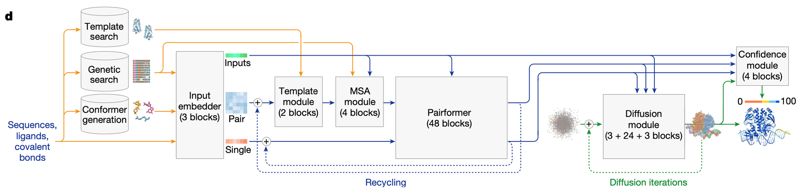
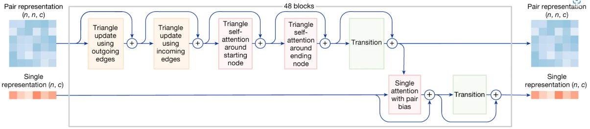
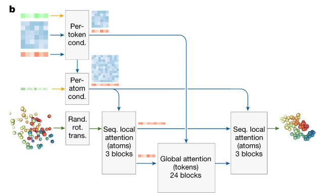
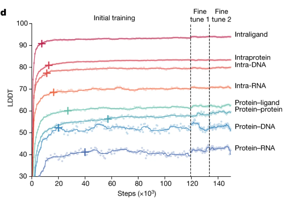

In this week’s module, we delve into fundamental bioinformatics tools and concepts essential for understanding sequence and structure comparisons, as well as structure prediction. The primary goal is to learn how evolutionary relationships can be inferred from biological data using computational methods. Below is an overview of each tool and method covered in this week, along with their URLs and example usage templates.

## **1. Phylogenetic Trees**

A phylogenetic tree represents the evolutionary relationships among various biological species based on similarities and differences in their genetic or physical traits. These trees are constructed using sequence alignment data.

#### **Common Tools for Phylogenetic Tree Construction**

* [IQ-TREE](http://www.iqtree.org/): Maximum likelihood-based tree building
* **[MEGA](https://www.megasoftware.net/)**: An integrated tool for evolutionary analysis
* **[FigTree](http://tree.bio.ed.ac.uk/software/figtree/)** : A tool for visualizing phylogenetic trees

> Lam-Tung Nguyen, Heiko A. Schmidt, Arndt von Haeseler, Bui Quang Minh, IQ-TREE: A Fast and Effective Stochastic Algorithm for Estimating Maximum-Likelihood Phylogenies,  *Molecular Biology and Evolution* , Volume 32, Issue 1, January 2015, Pages 268–274, [https://doi.org/10.1093/molbev/msu300](https://doi.org/10.1093/molbev/msu300)
>
> Sudhir Kumar, Glen Stecher, Michael Suleski, Maxwell Sanderford, Sudip Sharma, Koichiro Tamura, MEGA12: Molecular Evolutionary Genetic Analysis Version 12 for Adaptive and Green Computing,  *Molecular Biology and Evolution* , Volume 41, Issue 12, December 2024, msae263, [https://doi.org/10.1093/molbev/msae263](https://doi.org/10.1093/molbev/msae263)

#### **Basic Steps for Building a Phylogenetic Tree**

1. Align sequences (using MAFFT or other alignment tools).
2. Generate a distance matrix.
3. Construct the phylogenetic tree.

**Key Resources:**

* [IQ-TREE Official Website](http://www.iqtree.org/)
* [MEGA Official Website](https://www.megasoftware.net/)
* [FigTree Official Website
  ](http://tree.bio.ed.ac.uk/software/figtree/)

---

## **2. Multiple Sequence Alignment using Fast Fourier Transform(MAFFT)**

**Official Website:** [MAFFT](https://mafft.cbrc.jp/alignment/software/)

MAFFT employs  **Fast Fourier Transform (FFT)** , a mathematical technique, to identify homologous regions (similar sequence regions) by converting amino acid or nucleotide sequences into numerical vectors based on their physicochemical properties. Instead of comparing sequences directly in their original form, MAFFT processes them in a way that speeds up the identification of regions of similarity.

### **2.1Key Features**

* High-speed sequence alignment
* Multiple algorithms for local and global alignments
* Suitable for large datasets

### **2.2. Algorithms and Modes in MAFFT**

MAFFT provides different modes based on the computational complexity and the type of data:

1. **Auto Mode (`--auto`)**
   * Automatically selects the most suitable algorithm for the dataset.
2. **Fast Mode (FFT-NS-1, FFT-NS-2)**
   * Prioritizes speed over alignment accuracy.
3. **Accurate Mode (L-INS-i, G-INS-i)**
   * Provides higher accuracy by including iterative refinement but is slower.
4. **PartTree Algorithm**
   * For extremely large datasets, the "PartTree" approach allows for faster computation by using a tree-based progressive alignment.

---

### **4. How FFT Works in MAFFT**

FFT works by converting sequences into a frequency space:

* **Step 1:** Each sequence is represented as a vector based on a scoring scheme.
* **Step 2:** FFT is applied to transform the sequence into a frequency domain.
* **Step 3:** Similar patterns across sequences are identified by comparing the transformed vectors.
* 

FFT reduces the time complexity of finding homologous regions from $O(L^2)$ (for brute-force sliding comparisons) to $O(L \log L)$, where $L$ is sequence length. 
#### **Basic Command Line Usage:**

```bash
mafft --auto input.fasta > output.aln
```

**Explanation:**

* `--auto`: Automatically selects the best alignment strategy based on input size.
* `input.fasta`: Input FASTA file containing sequences to align.
* `output.aln`: Output file containing the aligned sequences.

---
#### Pseudo-Code for MAFFT
```txt
Input:
- S: List of unaligned biological sequences (DNA/RNA/Proteins)
- max_iterations: Optional number of refinement iterations (default: 2)

Output:
- M: Multiple sequence alignment matrix with gaps inserted

Procedure:

1. Compute Pairwise Distances using FFT:
   For each pair (S_i, S_j) in S:
      a. Convert S_i and S_j to numerical vectors (e.g., physicochemical properties for proteins).
      b. Compute FFT for both vectors (FFT(S_i), FFT(S_j)).
      c. Calculate cross-correlation via inverse FFT (iFFT(FFT(S_i) * conjugate(FFT(S_j)))).
      d. Identify high-scoring segments from cross-correlation to determine similarity.
      e. Compute normalized distance D_ij based on similarity score (lower D = higher similarity).

2. Build Guide Tree:
   a. Construct distance matrix D from all pairwise distances.
   b. Build binary guide tree T using hierarchical clustering (e.g., UPGMA or Neighbor-Joining).

3. Progressive Alignment:
   a. Initialize each sequence as a leaf node in T.
   b. Traverse T from leaves to root:
      i. For each internal node with child nodes L and R:
         - If L and R are leaves: 
             Align S_L and S_R using FFT-accelerated pairwise alignment.
         - Else: 
             Perform profile-profile alignment of the existing alignments from L and R.
         - Insert gaps to merge alignments while maximizing the objective function (e.g., sum-of-pairs).
      ii. Store the merged alignment as the profile for the current node.

4. Iterative Refinement:
   a. Initialize M with the progressive alignment result.
   b. For iteration in 1 to max_iterations:
      i. Randomly partition M into two subgroups (A and B).
      ii. Realign subgroups A and B independently using profile alignment.
      iii. Merge the realigned A and B into a new alignment M'.
      iv. If alignment_score(M') > alignment_score(M):
             Update M = M'
      v. Else: 
             Revert to previous M.
   c. Terminate if no improvement in last k iterations or max_iterations reached.

5. Return final alignment M.
```

> ##### TIP 
>
>Can you estimate the time complexity for this alogrithm implementation? 
{: .block-tip}
---

### **3. BLAST (Basic Local Alignment Search Tool)**

#### **Overview**

BLAST is a sequence similarity search tool used to compare nucleotide or protein sequences against databases. It helps identify homologous sequences and annotate unknown sequences.

**Key Types of BLAST:**

* **blastn** : Nucleotide vs. nucleotide database
* **blastp** : Protein vs. protein database
* **blastx** : Translated nucleotide vs. protein database

**Official Website:** [BLAST NCBI](https://blast.ncbi.nlm.nih.gov/)

#### **Basic Web Interface Use:**

1. Visit the NCBI BLAST page.
2. Paste the sequence of interest.
3. Select the appropriate BLAST type (blastn, blastp, etc.).
4. Choose a database (e.g., nr, SwissProt).
5. Click "BLAST".

**Command Line Example:**

```bash
blastp -query input.fasta -db nr -out results.txt -evalue 0.001 -num_threads 4
```

> ##### TIP
> `-query`: Input sequence file.
> `-db`: Database to search against (e.g., `nr` for non-redundant database).
> `-out`: Output file for results.
> `-evalue`: E-value cutoff for significance.
> `-num_threads`: Number of CPU threads to use.
{: .block-tip}


#### **How BLAST works**
1. **Preprocess the Query Sequence**:  
   - Split the `query_sequence` into overlapping **words** (k-mers) of length `word_size`.  
   - For protein sequences:  
     - Generate all words and their **neighborhood** (words with scores ≥ `threshold_T` using the substitution matrix).  

2. **Scan the Database**:  
   For each `target_sequence` in `database`:  
   - **Step 2a: Find Seed Matches**  
     Identify positions in `target_sequence` where query words (or their neighbors) match.  

   - **Step 2b: Two-Hit Trigger (Optional)**  
     To reduce false positives, require **two non-overlapping hits** on the same diagonal within a window (e.g., 40 amino acids for proteins).  

3. **Ungapped Extension**:  
   For each seed hit:  
   - Extend the match bidirectionally (left and right) without allowing gaps.  
   - Stop when the cumulative score drops below a threshold (e.g., `X%` of the maximum score seen so far).  
   - Retain extensions with scores ≥ `threshold_S`.  

4. **Gapped Extension (Optional)**:  
   For high-scoring ungapped HSPs:  
   - Use a **dynamic programming** (DP) approach (e.g., modified Smith-Waterman) to allow gaps.  
   - Apply the **X-dropoff heuristic** to terminate extensions early if the score drops too far below the best seen.  

5. **Statistical Evaluation**:  
   - Calculate the **bit score** for each HSP:  
     $$
     \text{Bit Score} = \frac{\lambda \times S - \ln K}{\ln 2}
     $$  
     (where $ \lambda $, $ K $ are Karlin-Altschul parameters).  
   - Compute the **E-value** (expected number of random HSPs with score ≥ $ S $):  
     $$
     E = \frac{m \times n}{2^{\text{Bit Score}}}
     $$  
     (where $ m = \text{query length}, n = \text{database size} $).  

6. **Filter and Report**:  
   - Discard HSPs with $E > \text{E\_value\_cutoff}$.  
   - Sort remaining HSPs by score or E-value.  
   - Return alignments with positions, scores, E-values, and sequence identities.  

---

### **4. AlphaFold3 (Protein Structure Prediction)**

#### **AlphaFold Overview**

AlphaFold(AF) is a revolutionary AI-based system developed by DeepMind that predicts protein structures from amino acid sequences with high accuracy. Unlike AF2, AF3 is a conditional diffuion model.

#### AF3 architecture 

The overall architecture of AlphaFold 3 (AF3) is similar to AlphaFold 2 (AF2). Both systems use a **large network trunk** (the Evoformer in AF2 and the Pairformer in AF3) to refine a pairwise representation of the molecular complex. This representation is then passed to either the StructureModule (in AF2) or the DiffusionModule (in AF3) to generate explicit atomic positions.


> ##### TIP
>Large network trunk: the core part of the neural network architecture responsible for processing and refining the input data to generate meaningful representations of the molecular structure. It acts as the backbone of the model, handling the bulk of the computational work. It processes input data (e.g., sequences, multiple sequence alignments, or pairwise interactions) and refines it into a pairwise representation. For AF2, its evoformer; AF3, it is pairformer.
{: .block-tip}

However, **AF3 introduces major modifications** to:

+ Handle diverse chemical entities: AF3 is designed to predict structures for a wide range of molecules (proteins, nucleic acids, ligands, etc.) without requiring extensive customization for each type.

+ Improve accuracy: AF3 achieves higher accuracy in protein structure predictions compared to AF2.

**Key Innovation in AF3**: conditional diffusion model, meaning most of the computational effort goes into conditioning the model (preparing the input data). Unlike AF2, where coordinates are recycled with single and pair representations, AF3 iteratively denoises the coordinates directly in the DiffusionModule. This approach allows AF3 to refine structures more effectively and handle complex molecular interactions with greater precision.

> ##### TIP
>
> This is just my opinion about the key innovation part in AF3.
{: .block-tip}

#### AF3 usage
For simple cases, just use [Alphafold3 sever](https://alphafoldserver.com/) 
>Abramson, J., Adler, J., Dunger, J. et al. Accurate structure prediction of biomolecular interactions with AlphaFold 3. Nature 630, 493–500 (2024). https://doi.org/10.1038/s41586-024-07487-w

#### Detailed comparison with AF2
+ support protein-dsDNA/RNA binding prediction, instead of just protein(polypeptide).
+ Speed up MSA process by replacing AF2 Evoformer with MSA module and pariformer
+ Replace structure module with diffusion module to generate 3d structures.

> ##### WARNING
>
> AF3 only support double strand DNA input. IF you want to try single strand, use RoseTTAFold2NA, https://github.com/uw-ipd/RoseTTAFold2NA.
{: .block-warning }

#### Evoformer -> MSA module and pairformer 

##### **MSAModule (AF3 vs. AF2)**

| Feature               | AF2 Evoformer (48 blocks)          | AF3 MSAModule (4 blocks)           |
|-----------------------|------------------------------------|------------------------------------|
| Sequence-level feature | Uses MSA (row-wise & column-wise attention) | Uses MSA (simpler pair-weighted average) |
| Structure-level feature| Pair representation (complex updates) | Pair representation (similar updates) |
| Communication          | Outer product mean, pair bias      | Outer product mean, pair bias      |

##### **Pairformer (AF3 vs. AF2)**

| Feature               | AF2 Evoformer (48 blocks)          | AF3 Pairformer (48 blocks)         |
|-----------------------|------------------------------------|------------------------------------|
| Sequence-level feature | Uses MSA (row-wise & column-wise attention) | Uses single representation (only row-wise attention) |
| Structure-level feature| Pair representation (complex updates) | Pair representation (similar updates) |
| Communication          | Outer product mean, pair bias      | Pair bias                          |


##### Key Changes in AF3:
1. **Simpler MSA Processing**:  
   - AF3 uses a smaller **MSAModule** (4 blocks instead of 48).  
   - It processes MSA data with a simpler method (pair-weighted average).  

2. **De-emphasized MSA**:  
   - After the MSAModule, only the **first row** (single representation) is passed to the **Pairformer**.  
   - This reduces complexity and improves efficiency.  

3. **Focus on Pair Representation**:  
   - The **Pairformer** in AF3 still uses 48 blocks, but it works mainly with pair and single representations.  
   - It avoids complex MSA processing, making it faster and easier to handle diverse molecules.  


##### Why These Changes Matter:
- **Efficiency**: AF3 simplifies the architecture, making it faster and more scalable.  
- **Generalization**: By focusing on pair and single representations, AF3 can handle a wider range of molecules (proteins, RNA, ligands, etc.).  
- **Accuracy**: Despite being simpler, AF3 achieves higher accuracy in predicting biomolecular structures.  
**Key Design Change in AF3**:  
The MSA representation is de-emphasized in AF3. It is first processed by a smaller, simpler MSAModule (4 blocks instead of 48), and only the **first row** (single representation) is passed to the core Pairformer for further refinement.  
> ##### TIP
>
> if you want to compare with evoformer achitecture, please check: Original AF2 paper: Jumper, J., Evans, R., Pritzel, A. et al. Highly accurate protein structure prediction with AlphaFold. Nature 596, 583–589 (2021). https://doi.org/10.1038/s41586-021-03819-2
{: .block-tip}

#### AF2 Structure module vs. AF3Diffusion Module


| Feature               | AF2 StructureModule                | AF3 DiffusionModule                |
|-----------------------|------------------------------------|------------------------------------|
| **Model Type**        | Predictive (predicts structure)    | Generative (generates structure)   |
| **Resolution**        | Residue level (focuses on residues)| All-atom level (handles all atoms) |
| **Operates On**       | Residue frames and side-chain angles (\( \chi \)) | Raw atom coordinates               |
| **Equivariance**      | Forced to satisfy (rigid constraints) | Not required (more flexible)       |
| **Attention Type**    | IPA (Invariant Point Attention)    | 1. Sequence local (atom-level) <br> 2. Global (token-level) <br> 3. Sequence local (atom-level) |
| **Major Loss**        | FAPE loss (Frame-Aligned Point Error) | MSE loss (Mean Squared Error)      |
| **Initial Coordinates**| Black hole initialization (starts from scratch) | Generated conformer (starts with a rough structure) |

---
**Key Changes in AF3 DiffusionModule**:
1. **Generative Approach**:  
   - AF3 uses a **diffusion-based generative model** to create structures, unlike AF2's predictive approach.  
   - This allows AF3 to handle a wider range of molecules (e.g., proteins, RNA, ligands) more effectively.  

2. **All-Atom Level**:  
   - AF3 works directly with **raw atom coordinates**, while AF2 focuses on residue-level frames and side-chain angles.  
   - This makes AF3 more precise in modeling complex molecular interactions.  

3. **Flexible Equivariance**:  
   - AF3 does not enforce rigid equivariance constraints, making it more adaptable to diverse molecular structures.  

4. **Attention Mechanism**:  
   - AF3 uses a combination of **local and global attention** to refine atom positions, improving both local and global accuracy.  

5. **Loss Function**:  
   - AF3 uses **MSE loss** (Mean Squared Error) to minimize differences between predicted and true atom positions, simplifying training.  

6. **Initialization**:  
   - AF3 starts with a **generated conformer** (rough structure), while AF2 uses a "black hole" initialization (starting from scratch).  


**Why These Changes Matter**:
- **Better Accuracy**: AF3's generative approach and all-atom resolution lead to more accurate predictions.  
- **Flexibility**: AF3 can model a wider variety of biomolecules, including proteins, nucleic acids, and small molecules.  
- **Simplified Training**: The use of MSE loss and flexible equivariance makes AF3 easier to train and more robust.  
>Baek, M., McHugh, R., Anishchenko, I. et al. Accurate prediction of protein–nucleic acid complexes using RoseTTAFoldNA. Nat Methods 21, 117–121 (2024). https://doi.org/10.1038/s41592-023-02086-5

#### Confidence Score

| Feature                  | AF2 Confidence Module               | AF3 Confidence Module               |
|--------------------------|-------------------------------------|-------------------------------------|
| **Heads**                | - pAE head                         | - pAE head                         |
|                          | - pLDDT head                       | - pLDDT head                       |
|                          | - Experimentally resolved head     | - Experimentally resolved head     |
|                          |                                    | - pDE head                         |
| **pAE Head Input**       | Pair representation (Evoformer output) | Pair representation (mini-Pairformer output, including input features, single features, and distance information from rolled-out coordinates) |
| **pLDDT Head Input**     | Single representation (Structure module output) | Single representation (mini-Pairformer output, including input features, pair features, and distance information from rolled-out coordinates) |
| **Input Gradient**       | Not detached                       | Detached    

##### **Key differences**
1. **Additional Head in AF3**:
   - AF3 introduces a **pDE head** (Predicted Distance Error), which is not present in AF2. This head helps improve the accuracy of distance predictions.
2. **Input Features**:
   - In AF3, both the **pAE head** and **pLDDT head** use outputs from the **mini-Pairformer**, which includes additional information like input features, single features, and distances from rolled-out coordinates.
   - In AF2, these heads rely solely on the outputs from the Evoformer or Structure module.
3. **Gradient Handling**:
   - AF3 **detaches** the input gradient during training, which can help stabilize the learning process.
   - AF2 does not detach the gradient, meaning the gradients flow back through the entire network.
*** Why change? 
improve condidence prediction, stability and flexibility

#### Training results


> ##### TIP
>
>LDDT: The LDDT score (Local Distance Difference Test) is a metric used to evaluate the accuracy of predicted protein structures. It ranges from 0 to 100, where higher socres indicate better local accuracy.
{: .block-tip}

#### **Advanced Use (Local Installation with Docker):**
Official Repository: [AlphaFold GitHub](https://github.com/deepmind/alphafold)
Before you install, make sure you have enough GPU memory. 

1. Apply for the model paramter. (check its github repo Obtaining Model Parameters section.)

2. Clone the repository and install all dependencies as instruction suggested.
---
### **5. Foldseek (Fast Structure Search)**

#### **Overview**

Foldseek is a fast and accurate tool for searching protein 3D structures against databases. It provides a structural analogy to sequence-based search tools like BLAST.

#### **Key Features:**

* Ultrafast comparison of protein folds.
* Enables exploration of structure-function relationships.

**Official Repository:** [Foldseek GitHub](https://github.com/steineggerlab/foldseek)

#### **Basic Command Line Usage:**

```bash
foldseek easy-search input.pdb structure_db result.m8 tmp/
```

> ##### TIP
>
> `input.pdb`: Input protein structure file in PDB format.
> `structure_db`: Database of 3D structures to search against.
> `result.m8`: Output file containing the search results.
> `tmp/`: Temporary directory for intermediate files.
{.block-tip}

#### Procedure
 1. **Encode Structures as "3Di Sequences"**
   For each amino acid in a protein, Foldseek looks at its **closest neighbor in 3D space** (not just adjacent in the sequence), which describes this interaction using a **20-letter "3Di alphabet"** (e.g., "A" might mean two residues are twisted in a specific way). This turns the 3D structure into a 1D "structural sequence" (like DNA but for shape).

2. **Fast Pre-Screening**
   Foldseek uses **sequence alignment tricks** (from tools like BLAST) to quickly find rough matches between 3Di sequences. For example, if two proteins have similar 3Di "words" (like "ABC" vs. "ABD"), they might share structural similarities.

3. **Refine Matches**
   High-scoring candidates undergo **detailed 3D alignment** (like TM-align) to confirm similarity, which calculates scores based on structural overlap and evolutionary conservation.

> ##### TIP
> 
> Terminology: 
>**3Di Alphabet**: A "language" describing how amino acids interact in 3D space.
> **Prefiltering**: Quickly filtering out bad matches to focus on promising ones.
> **TM-score**: A measure of structural similarity (0–1; higher = better match).
{: .block-tip}

Reference:
>van Kempen, M., Kim, S.S., Tumescheit, C. et al. Fast and accurate protein structure search with Foldseek. Nat Biotechnol 42, 243–246 (2024). https://doi.org/10.1038/s41587-023-01773-0


---
The end.