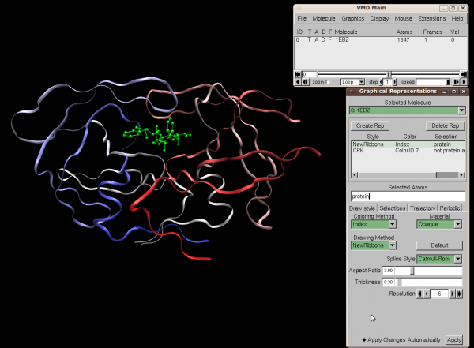
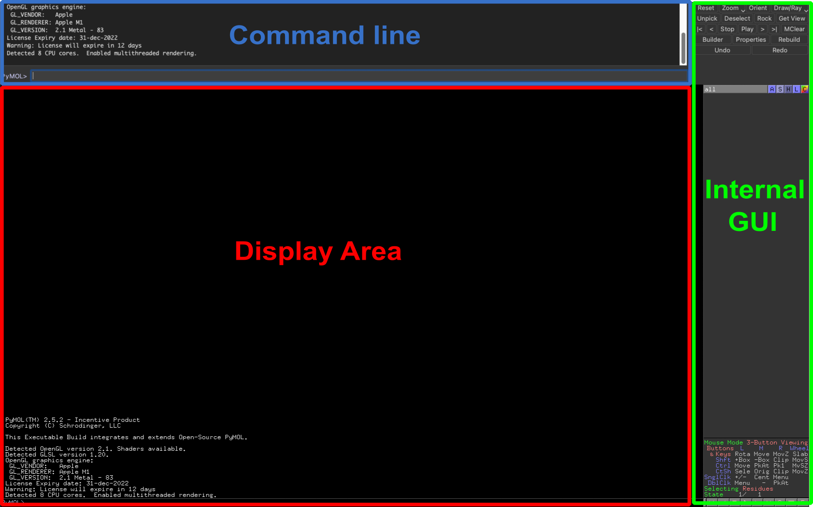

## **1. Overview of Force Fields and Molecular Dynamics Simulations**

Molecular dynamics (MD) simulations are computational methods used to study the physical movements of atoms and molecules over time. MD simulations rely on **force fields** to describe the interactions between atoms in the system.

### **1.1 Nobel Prize 2013 in Chemistry**

* **Awardees** : Martin Karplus, Michael Levitt, and Arieh Warshel.

* **Reason** : For their development of **multiscale models** for complex chemical systems, which combined classical physics (molecular mechanics) and quantum mechanics to simulate biomolecular processes.
* **Significance** : for the development of multiscale models for complex chemical systems

>MLA style: The Nobel Prize in Chemistry 2013. NobelPrize.org. Nobel Prize Outreach 2025. Sun. 26 Jan 2025. <https://www.nobelprize.org/prizes/chemistry/2013/summary/>

---
## 2. Force Fields for MD simulations
A **force field** is a mathematical model that describes the potential energy of a system of atoms. It includes terms for bond stretching, angle bending, torsional angles, and non-bonded interactions (van der Waals and electrostatic interactions).
Below is a concise overview of three major force-field families—CHARMM, AMBER, and MARTINI—along with their general functional forms and suggestions on when to use each variant.

---

## 2. Force Fields for MD Simulations

Although many classical force fields share a similar *overall* functional form, each family may include additional terms or slightly different expressions to handle various molecular interactions. Below are *representative* equations and key points for each.

---

### 2.1 CHARMM

**Representative Variants**  
- **CHARMM22**: Protein-focused.  
- **CHARMM27**: Nucleic acids.  
- **CHARMM36**: Updated parameters for lipids and proteins.

**Functional Form**  
CHARMM’s potential energy $ E_{\text{CHARMM}} $ often includes Urey–Bradley terms for angle bending and a CMAP correction for protein dihedral angles:

$$
\begin{aligned}
E_{\mathrm{CHARMM}} \;=\;& \sum_{\text{bonds}} k_b\, (r - r_0)^2 
\;+\; \sum_{\text{angles}} k_\theta \, (\theta - \theta_0)^2 \\
&+\; \underbrace{\sum_{\text{Urey-Bradley}} k_{UB} \,(r_{1,3} - r_{1,3,0})^2}_{\text{coupling between 1–3 atoms}} 
\;+\; \sum_{\text{dihedrals}} \sum_{n} \frac{V_n}{2}\,\bigl[1 + \cos(n\,\phi - \gamma)\bigr] \\
&+\; \underbrace{\sum_{\text{impropers}} k_{\mathrm{imp}}\,(\chi - \chi_0)^2}_{\text{planarity corrections}}  
\;+\; \underbrace{E_{\mathrm{CMAP}}(\phi,\psi)}_{\text{dihedral correction map}} \\
&+\; \sum_{i<j} \Biggl[
4\,\epsilon_{ij}\biggl(\bigl(\tfrac{\sigma_{ij}}{r_{ij}}\bigr)^{12} - \bigl(\tfrac{\sigma_{ij}}{r_{ij}}\bigr)^{6}\biggr)
\;+\; \frac{q_i\,q_j}{4\pi\,\epsilon_0\,\epsilon_r\,r_{ij}}
\Biggr].
\end{aligned}
$$

1. **When to Use which CHARMM FF**  
   - **Proteins and Membranes**: CHARMM36 is well-known for accurate lipid parameters. CHARMM22 is protein-focused.
   - **Nucleic Acids**: CHARMM27 has refined parameters for DNA/RNA.  

---

### 2.2 AMBER

**Representative Variants**  
- **ff14SB**: Proteins.  
- **OL3, bsc1**: RNA/DNA.  
- **GAFF**: General organic molecules (ligands, small molecules).

**Functional Form**  
AMBER’s potential energy $ E_{\text{AMBER}} $ typically omits Urey–Bradley or CMAP but otherwise follows a standard bonded + non-bonded scheme:

$$
\begin{aligned}
E_{\mathrm{AMBER}} \;=\;&
\underbrace{\sum_{\text{bonds}} \tfrac{1}{2} k_b (r - r_0)^2}_{\text{bond stretching}} \;+\;
\underbrace{\sum_{\text{angles}} \tfrac{1}{2} k_\theta (\theta - \theta_0)^2}_{\text{angle bending}} \\
&+\; \underbrace{\sum_{\text{torsions}} \sum_n \tfrac{V_n}{2}\bigl[1 + \cos(n\,\phi - \gamma)\bigr]}_{\text{torsional rotation}} \\
&+\; \underbrace{\sum_{i<j} \Bigl[
4\,\epsilon_{ij}\Bigl(\bigl(\tfrac{\sigma_{ij}}{r_{ij}}\bigr)^{12} 
- \bigl(\tfrac{\sigma_{ij}}{r_{ij}}\bigr)^{6}\Bigr)
\;+\; \tfrac{q_i\,q_j}{4\pi\,\epsilon_0\,\epsilon_r\,r_{ij}}
\Bigr]}_{\text{LJ + Coulomb non-bonded}}.
\end{aligned}
$$

1. **When to Use AMBER**  
   - **Protein–Ligand Binding & Drug Design**: Excellent for free energy calculations.  
   - **Nucleic Acids**: Specialized nucleic acid force fields (e.g., OL3, bsc1).  
   - **Advantages**: Extensive parameter sets for small molecules (GAFF), stable free-energy pipelines.

---
### 2.3 MARTINI
The MARTINI force field is a widely used coarse-grained (CG) model developed by Siewert-Jan Marrink and coworkers at the University of Groningen. Originally introduced in 2004 for lipid simulations,[1] MARTINI was later extended in 2007 to cover proteins, carbohydrates, small molecules, and more.[2] Its core philosophy is to represent groups of four heavy atoms (4:1 mapping) as single beads, systematically parametrized to reproduce thermodynamic properties (especially partitioning free energies). A major update was released in 2021, known as MARTINI 3, offering refined parameters and broader applicability.[3]

####Key Features
+ Four Main Bead Categories: Q (Charged), P (Polar), N (Nonpolar), and C (Apolar).
    + Each category is split into multiple levels (e.g., hydrogen-bond donor/acceptor or polarity strength).
    + In total, MARTINI defines up to 20 bead types across 10 interaction levels (O–IX).
+ Variable Mapping/Coarse-Graining Schemes
    + **Standard (4:1)** for most aliphatic groups.
    + S-size (3:1) for ring structures (e.g., cholesterol, benzene).
    + T-size (2:1) primarily for nucleic acids.
+ Bonded & Nonbonded Parameters
    + Bonded Terms (bonds, angles, dihedrals, impropers) derived from atomistic simulations or crystal structures.
    + Nonbonded Interactions: Shifted Lennard-Jones (12–6) plus shifted Coulomb potential with a relative dielectric constant ($\epsilon_r$) around 15.

> Marrink, S.J.; de Vries, A.H.; Mark, A.E. J. Phys. Chem. B 2004, 108, 750–760.
>Marrink, S.J.; Risselada, H.J.; Yefimov, S.; Tieleman, D.P.; de Vries, A.H. J. Phys. Chem. B 2007, 111, 7812–7824.
>Souza, P.C.T.; et al. Nat. Methods 2021, 18, 382–388.

---

## **3.MD Software for Biomolecules**

### **3.1 CHARMM (Chemistry at HARvard Macromolecular Mechanics)**

 **URL** : [https://www.charmm.org](https://www.charmm.org/)

* **Description** : CHARMM is a widely adopted force field and molecular simulation program developed by Martin Karplus group, designed for biomolecular and material simulations. It provides robust energy functions, enhanced sampling techniques, and multi-scale modeling capabilities (e.g., QM/MM, MM/CG, and implicit solvent models).
* **Key Features** :
    * Supports proteins, nucleic acids, lipids, carbohydrates, and small molecule ligands.
    * Compatible with **MD software** such as NAMD, GROMACS, and CHARMM itself.
    * Comprehensive energy functions for accurate simulations of molecular 
    * Supports enhanced sampling methods, including umbrella sampling and metadynamics.
    * Multi-scale modeling support, including QM/MM (quantum mechanics/molecular mechanics), MM/CG (molecular mechanics/coarse-grained), and implicit solvent models.
* **Applications** :
    * Simulating protein folding, ligand binding, and membrane dynamics.
* **Getting start**: 
    * To use CHARMM, please check their [official documentation](https://academiccharmm.org/documentation).
* **Template Application**: check [here](https://academiccharmm.org/showcase)

* References

    >1.W. Hwang, S. L. Austin, A. Blondel, E. D. Boittier, S. Boresch, M. Buck, J. Buckner, A. Caflisch, H.-T. Chang, X. Cheng, Y. K. Choi, J.-W. Chu, M. F Crowley, Q. Cui, A. Damjanovic, Y. Deng, M. Devereux, X. Ding, M. Feig, J. Gao, D. R. Glowacki, J. E. Gonzales, M. B. Hamaneh, E. D. Harder, R. L. Hayes, J. Huang, Y. Huang, P. S. Hudson, W. Im, S. M. Islam, W. Jiang, M. R. Jones, S. Käser, F. L. Kearns, N. R. Kern, J. B. Klauda, T. Lazaridis, J. Lee, J. A. Lemkul, X. Liu, Y. Luo, A. D. MacKerell Jr, D. T. Major, M. Meuwly, K. Nam, L. Nilsson, V. Ovchinnikov, E. Paci, S. Park, R. W. Pastor, A. R. Pittman, C. B. Post, S. Prasad, J. Pu, Y. Qi, T. Rathinavelan, D. R. Roe, B. Roux, C. N. Rowley, J. Shen, A. C. Simmonett, A. J. Sodt, K. Töpfer, M. Upadhyay, A. van der Vaart, L. I. Vazquez-Salazar, R. M. Venable, L. C. Warrensford, H. L. Woodcock, Y. Wu, C. L. Brooks III, B. R. Brooks, M. Karplus: CHARMM at 45: Enhancements in Accessibility, Functionality, and Speed, J. Phys. Chem. B (2024), 128, 9976-10042 https://doi.org/10.1021/acs.jpcb.4c04100
    >
    >2.B. R. Brooks, C. L. Brooks III, A. D. Mackerell, L. Nilsson, R. J. Petrella, B. Roux, Y. Won, G. Archontis, C. Bartels, S. Boresch A. Caflisch, L. Caves, Q. Cui, A. R. Dinner, M. Feig, S. Fischer, J. Gao, M. Hodoscek, W. Im, K. Kuczera, T. Lazaridis, J. Ma, V. Ovchinnikov, E. Paci, R. W. Pastor, C. B. Post, J. Z. Pu, M. Schaefer, B. Tidor, R. M. Venable, H. L. Woodcock, X. Wu, W. Yang, D. M. York, and M. Karplus: CHARMM: The Biomolecular simulation Program, J. Comp. Chem. 30, 1545-1615 (2009), 
    >
    >3.B. R. Brooks, R. E. Bruccoleri, B. D. Olafson, D. J. States, S. Swaminathan, and M. Karplus: CHARMM: A Program for Macromolecular Energy, Minimization, and Dynamics Calculations, J. Comp. Chem. 4, 187-217 (1983)
    >
    >4.A. D. MacKerell, Jr., B. Brooks,C. L. Brooks, III, L. Nilsson, B. Roux, Y. Won, and M. Karplus: CHARMM: The Energy Function and Its Parameterization with an Overview of the Program, in The Encyclopedia of Computational Chemistry, 1, 271-277, P. v. R. Schleyer et al., editors (John Wiley & Sons: Chichester, 1998)

---

### **3.2 AMBER (Assisted Model Building with Energy Refinement)**

 **URL** : [https://ambermd.org](https://ambermd.org/)

+ **Description**: Amber is a suite of biomolecular simulation tools designed for modeling and analyzing proteins, nucleic acids, and small molecules. It includes detailed molecular mechanical force fields and software for performing simulations. Amber has been actively developed since the late 1970s by a collaborative community of scientists from institutions worldwide.

+ **Key Features**:
    Comprehensive molecular force fields for proteins, nucleic acids, and small molecules.
    Popular force fields such as AMBER ff99SB, optimized for protein dynamics.
    Support for a wide range of biomolecular simulations and analyses.

+ **Software**:
    + [Amber24](https://ambermd.org/AmberMD.php):  free, open-source suite comprising various independently developed packages.
    + [AmberTools24](https://ambermd.org/AmberTools.php): commerical license, adding high-performance simulation capabilities.

+ References: 
    >R. Salomon-Ferrer, D.A. Case, R.C. Walker. An overview of the Amber biomolecular simulation package. WIREs Comput. Mol. Sci. 3, 198-210 (2013). (https://ambermd.org/2012_wires.pdf)

---

### **3.3 NAMD (Nanoscale Molecular Dynamics)**

 **URL** : [https://www.ks.uiuc.edu/Research/namd](https://www.ks.uiuc.edu/Research/namd)

* **Description** : A highly scalable molecular dynamics program designed for parallel simulations of large biomolecular systems.
* **Key Features** :
    * Supports CHARMM, AMBER, and OPLS force fields.
    * Optimized for simulations on supercomputers and GPU clusters.
    * Integrates seamlessly with visualization tools like VMD (Visual Molecular Dynamics).

### **2.5 GROMACS (GROningen MAchine for Chemical Simulations)**

 **URL** : [https://www.gromacs.org](https://www.gromacs.org/)

* **Description** : A versatile molecular dynamics simulation package known for its speed and efficiency.
* **Key Features** :
* Supports multiple force fields, including CHARMM, AMBER, and MARTINI.
* Optimized for both CPU and GPU simulations.
* **Applications** :
* Studies of protein dynamics, solvent effects, and molecular interactions.

---

## **3. Key Concepts in Molecular Dynamics Simulations**

### **3.1 Energy Terms in Force Fields**

The potential energy EtotalE_{\text{total}} of a system is described by the sum of individual contributions:

$$
E_{\text{total}} = E_{\text{bonds}} + E_{\text{angles}} + E_{\text{dihedrals}} + E_{\text{non-bonded}}
$$

* **Bond Stretching** : Energy cost of stretching or compressing chemical bonds.
* **Angle Bending** : Energy associated with deviations from ideal bond angles.
* **Torsional Angles** : Energy changes due to rotations around chemical bonds.
* **Non-Bonded Interactions** :
* **Van der Waals Forces** : Weak, attractive forces between atoms.
* **Electrostatic Interactions** : Coulombic forces between charged atoms.

### **3.2 Simulation Workflow**

1. **System Preparation** : Import PDB files and solvate the system.
2. **Energy Minimization** : Relax any steric clashes in the structure.
3. **Equilibration** : Apply constraints to stabilize the system at desired temperature and pressure.
4. **Production Run** : Perform molecular dynamics simulation for data collection.
5. **Analysis and Visualization** : Use tools like VMD to visualize the trajectory and analyze structural changes.

---

## **4. Visualization and Analysis with VMD**

### **4.1 VMD (Visual Molecular Dynamics)**

 **URL** : [https://www.ks.uiuc.edu/Research/vmd](https://www.ks.uiuc.edu/Research/vmd)

* **Purpose** : A visualization tool designed for displaying molecular dynamics trajectories.
* **Key Features** :
    * Reads molecular simulation files (.pdb, .gro, .xtc, .dcd).
    * Generates visualizations of macromolecular systems and trajectory movies.

### **4.2 PyMOL**

**URL**: [https://pymol.org](https://pymol.org)

* **Purpose**: A powerful molecular visualization tool used for the rendering and analysis of 3D structures of macromolecules.
* **Key Features**:
  * Reads and visualizes files in formats like (.pdb, .cif, .sdf).
  * Generates publication-quality images and animations of molecular structures.
  * Offers scripting capabilities for automated analyses.
