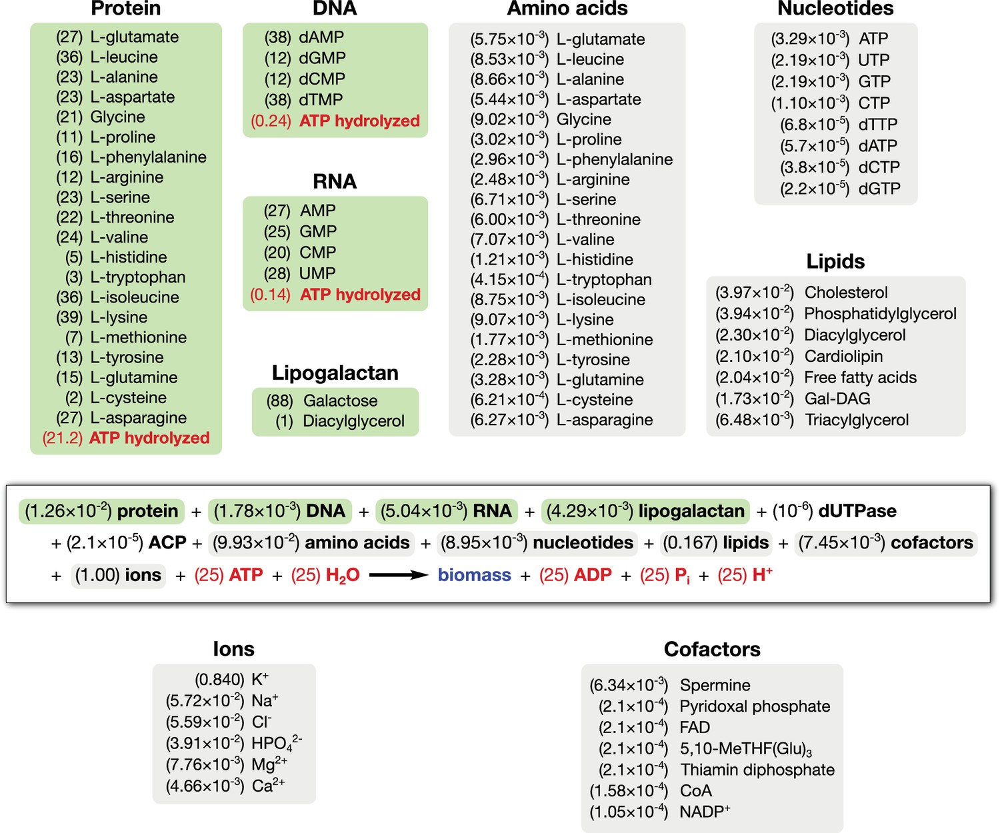
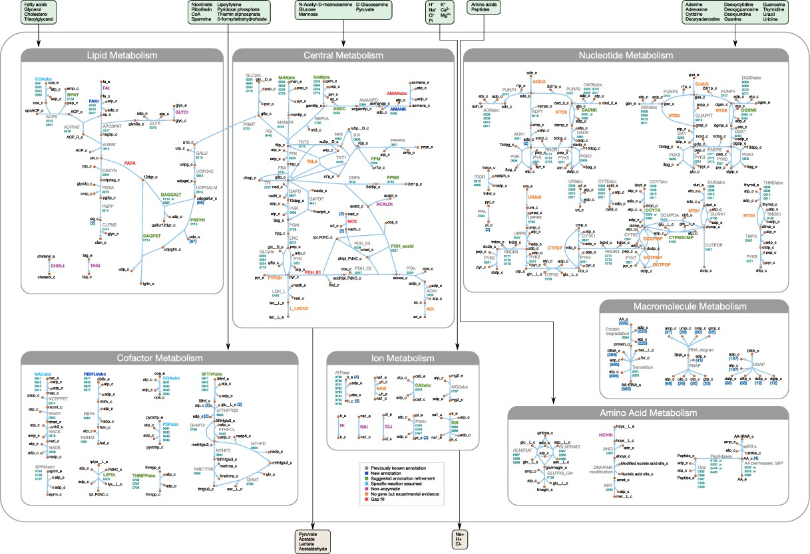

# **1. Systems Biology Overview**

* **Systems biology** focuses on understanding how molecular components (genes, proteins, metabolites) interact to form complex biological systems.

* **Key Concepts** :

  * **Metabolic Networks** : Pathways describing the transformation of substrates into products via enzymatic reactions.
  * **Steady-State Analysis** : Involves determining the flow of metabolites through these networks when the system is in equilibrium.


# **2. FBA model for minimal cell**

**Introduction to Flux Balance Analysis (FBA):**
* **Flux Balance Analysis** is a mathematical approach used to analyze metabolic networks by calculating the flow of metabolites through the network.
* **Purpose:** FBA predicts the metabolic flux distribution of a system at steady state, helping identify optimal growth conditions and metabolic capabilities.
* **Key Components:**
  * **Stoichiometric Matrix (S):** Represents all reactions and metabolites in the network
  * **Flux Vector (v):** Contains flux values for each reaction
  * **Objective Function:** Mathematical representation of cellular goals (often biomass production or ATP generation)
  * **Constraints:** Mass balance (Sv = 0) and reaction bounds (vmin ≤ v ≤ vmax)

 **Paper URL** : [https://doi.org/10.7554/eLife.36842](https://doi.org/10.7554/eLife.36842)

* **Title** : "Essential metabolism for a minimal cell."
* **Objective Function** : 
  
* **FBA Model Overview** :
  

>Breuer M, Earnest TM, Merryman C, Wise KS, Sun L, Lynott MR, Hutchison CA, Smith HO, Lapek JD, Gonzalez DJ, de Crécy-Lagard V, Haas D, Hanson AD, Labhsetwar P, Glass JI, Luthey-Schulten Z. Essential metabolism for a minimal cell. Elife. 2019 Jan 18;8:e36842. doi: 10.7554/eLife.36842. PMID: 30657448; PMCID: PMC6609329.

---

# **3. Tools for Metabolic Network Analysis**

## **3.1 CobraPy (COBRA Toolbox in Python)**

 **URL** : [https://cobrapy.readthedocs.io](https://cobrapy.readthedocs.io/)

* **Description** : A Python package for constraint-based modeling of metabolic networks.
* **Key Features** :
* Supports **flux balance analysis (FBA)** for predicting reaction flux distributions.
* Includes utilities for  **gene knockout simulations** ,  **essentiality tests** , and  **biomass flux calculations** .
* **Example Usage** :

```python
import cobra
model = cobra.io.read_sbml_model("ecoli_core_model.xml")
solution = model.optimize()
print(solution.fluxes)
```

## **3.2 ESCHER**

 **URL** : [https://escher.github.io](https://escher.github.io/)

* **Purpose** : A web-based tool for visualizing metabolic pathways.
* **Key Features** :
* Interactive metabolic network visualizations.
* Allows overlaying of flux values from FBA simulations.
* Supports maps for various organisms (e.g.,  *E. coli* , yeast).
* **Use Case** : Combine with CobraPy to visualize metabolic fluxes.

---

# 4. Stochastic Effects simulated with Chemical Master Equation (CME) and Gillespie Algorithm


1. Derivation of the CME starting from reaction propensities.
2. Explanation of probability flux and state transitions.
3. Detailed Gillespie Algorithm steps with mathematical justifications.
4. Examples of stochastic simulations applied to biochemical systems.


## 4.1 Chemical Master Equation (CME) Derivation

### Probability Flux and State Transitions
In stochastic chemical kinetics, the **state** of a well-stirred reaction system is defined by the copy numbers of each molecular species (e.g. $X_1, X_2, \ldots, X_N$ molecules). We denote the state as a vector $\mathbf{n} = (n_1, n_2, \ldots, n_N)$, where $n_i$ is the number of molecules of species $i$. Chemical **reactions** are events that change this state by consuming and producing molecules. Each reaction $R_j$ has an associated **stoichiometric change vector** $\boldsymbol{\nu}_j = (\nu_{1j}, \nu_{2j}, \ldots, \nu_{Nj})$ indicating how the state changes if reaction $j$ occurs (for example, a reaction $A \to B$ would have $\nu_{A}=-1$, $\nu_{B}=+1$).

When a reaction occurs, the system’s state jumps from $\mathbf{n}$ to a new state $\mathbf{n} + \boldsymbol{\nu}_j$. We can think of **probability flux** as the flow of probability *between states* due to these reactions. If $P(\mathbf{n}, t)$ is the probability that the system is in state $\mathbf{n}$ at time $t$, then each reaction channel causes probability to **leave** one state and **enter** another. For instance, if the system is in state $\mathbf{n}$, reaction $j$ *fires* with some rate and carries probability from state $\mathbf{n}$ to state $\mathbf{n}+\boldsymbol{\nu}_j$. Conversely, state $\mathbf{n}$ can gain probability from a different state $\mathbf{n}-\boldsymbol{\nu}_j$ when reaction $j$ occurs in that other state. The *incoming* probability flux to state $\mathbf{n}$ from reaction $j$ is proportional to $P(\mathbf{n}-\boldsymbol{\nu}_j, t)$, and the *outgoing* flux from $\mathbf{n}$ is proportional to $P(\mathbf{n}, t)$. The balance of these fluxes for all reactions will lead to the master equation.

### Reaction Propensities in a Well-Stirred System
In a **well-stirred system** (uniform mixing, no spatial variation), each reaction $R_j$ is characterized by a *propensity function* $a_j(\mathbf{n})$. The **propensity** $a_j(\mathbf{n})$ is defined such that: 

- $a_j(\mathbf{n})\,dt$ is the probability that one reaction $R_j$ will occur in the infinitesimal time interval $[t, t+dt)$ given that the system is in state $\mathbf{n}$ at time $t$ ([Stochastic Physics in Biology examples.pdf](file://file-NmMnBoVnNbBUTqmUJQfkA2#:~:text=The%20time%20evolution%20of%20P,by%20the%20chemical%20master%20equation)). 

This definition implies that $a_j(\mathbf{n})$ has units of [time]^(-1) and effectively serves as the *rate* or *hazard* for reaction $j$ in state $\mathbf{n}$. The functional form of $a_j(\mathbf{n})$ follows from basic **mass-action kinetics** considerations:
- For a **unimolecular** reaction (e.g. $A \to$ products with rate constant $k$), $a(\mathbf{n}) = k \cdot n_A$. This is because each of the $n_A$ molecules of $A$ can independently undergo the reaction.
- For a **bimolecular** reaction between two different species (e.g. $A + B \to$ products with rate $k$), $a(\mathbf{n}) = k \cdot n_A \cdot n_B$. Each pair of an $A$ and a $B$ molecule can collide to react.
- For a **bimolecular** reaction of two identical molecules (e.g. $2A \to$ products with rate $k$), $a(\mathbf{n}) = k \cdot \binom{n_A}{2} = k \frac{n_A (n_A - 1)}{2!}$, since any two $A$ molecules out of $n_A$ can form a reacting pair.

More generally, if reaction $j$ requires a combination of reactant molecules according to its stoichiometry, $a_j(\mathbf{n})$ is the product of the rate constant and the number of distinct reactant combinations present in state $\mathbf{n}$. These propensities serve as the **transition rates** between states in the master equation.

### Formulating the Chemical Master Equation
Using the concepts of state transitions and propensities, we can derive the **Chemical Master Equation (CME)**, which governs the time-evolution of the probability distribution $P(\mathbf{n}, t)$. The CME is essentially a **balance equation** accounting for probability flux into and out of each state $\mathbf{n}$:

**Derivation Steps:**
1. **Consider a small time interval $dt$:** Starting from state $\mathbf{n}$ at time $t$, in an infinitesimal $dt$ only one of the reaction channels can fire (or none at all) because the probability of two or more reactions in $dt$ is negligible ($O(dt^2)$). The possible ways to end up in state $\mathbf{n}$ at time $t+dt$ are:
   - The system was already in state $\mathbf{n}$ at time $t$ and **no reaction** occurred in $[t, t+dt)$. 
   - The system was in some other state $\mathbf{m}$ at time $t$ and **one reaction** occurred that carried the state from $\mathbf{m}$ to $\mathbf{n}$ during $[t, t+dt)$. The only way to arrive at $\mathbf{n}$ in a single reaction step is if $\mathbf{m} = \mathbf{n} - \boldsymbol{\nu}_j$ for some reaction $j$ (i.e. one reaction $j$ occurred bringing the state up to $\mathbf{n}$).

2. **Write the balance for $P(\mathbf{n}, t+dt)$:**  
   $$
   P(\mathbf{n}, t + dt) = P(\mathbf{n}, t)\Big[1 - \sum_{j=1}^M a_j(\mathbf{n})\,dt\Big] \;+\; \sum_{j=1}^M a_j(\mathbf{n} - \boldsymbol{\nu}_j)\,P(\mathbf{n}-\boldsymbol{\nu}_j, t)\,dt \,.
   $$ 
   This equation says: the probability of being in state $\mathbf{n}$ at time $t+dt$ comes from two contributions. The first term is the probability the system was in $\mathbf{n}$ and *no* reaction occurred in $dt$ (the factor in brackets is the probability of no reaction, i.e. 1 minus the probability that any of the $M$ reactions fired). The second term sums over all reactions $j$: if the system was in state $\mathbf{n}-\boldsymbol{\nu}_j$ at time $t$ and reaction $j$ occurred (with probability $a_j(\mathbf{n}-\boldsymbol{\nu}_j)\,dt$), the system will land in $\mathbf{n}$ at $t+dt$.

3. **Simplify and take the limit $dt \to 0$:** Subtract $P(\mathbf{n}, t)$ from both sides and divide by $dt$. Neglecting terms of $O(dt)$, we obtain the time derivative (left-hand side) in the limit:
   $$
   \frac{P(\mathbf{n}, t+dt) - P(\mathbf{n}, t)}{dt} = -\sum_{j=1}^M a_j(\mathbf{n})\,P(\mathbf{n}, t) \;+\; \sum_{j=1}^M a_j(\mathbf{n}-\boldsymbol{\nu}_j)\,P(\mathbf{n}-\boldsymbol{\nu}_j, t) \,.
   $$
   Recognizing the left side as $\frac{\partial P(\mathbf{n},t)}{\partial t}$ in the limit, we arrive at the **Chemical Master Equation**:
   $$
   \frac{\partial P(\mathbf{n}, t)}{\partial t} \;=\; \sum_{j=1}^M \Big[\,a_j(\mathbf{n}-\boldsymbol{\nu}_j)\,P(\mathbf{n}-\boldsymbol{\nu}_j, t)\;-\;a_j(\mathbf{n})\,P(\mathbf{n}, t)\Big]\,.
   $$
   This is a *birth–death* form: the first term in each difference $[\cdot]$ is the **gain** of probability *into* state $\mathbf{n}$ from state $\mathbf{n}-\boldsymbol{\nu}_j$ via reaction $j$, and the second term is the **loss** of probability *from* state $\mathbf{n}$ via reaction $j$. Summing over all reaction channels $j$ gives the net rate of change of $P(\mathbf{n},t)$.

This master equation is a system of coupled first-order differential equations, one for each possible state $\mathbf{n}$. In most cases, the state space is infinite or very large, so solving the CME directly is challenging. However, the CME completely specifies the stochastic dynamics of the reaction system.

**Expansion in Terms of Distributions:** The above CME can be written more explicitly by expanding the sum for each reaction. For example, if there are $M$ reactions, each reaction $j$ contributes a pair of terms to the equation for $\frac{\partial P(\mathbf{n},t)}{\partial t}$. As an illustration, consider a simple system with two reactions, $R_1$ and $R_2$. The CME for this system would be: 

$$
\frac{\partial P(\mathbf{n},t)}{\partial t} = a_1(\mathbf{n}-\boldsymbol{\nu}_1)P(\mathbf{n}-\boldsymbol{\nu}_1,t) + a_2(\mathbf{n}-\boldsymbol{\nu}_2)P(\mathbf{n}-\boldsymbol{\nu}_2,t)\;-\;a_1(\mathbf{n})P(\mathbf{n},t) - a_2(\mathbf{n})P(\mathbf{n},t)\,. 
$$

This expansion shows explicitly how probability flows from neighboring states into $\mathbf{n}$ and out of $\mathbf{n}$ for each reaction. In general, there will be as many gain-loss terms as there are reactions.

## Relationship to Deterministic Rate Equations
The Chemical Master Equation provides a **stochastic** description of reaction kinetics, whereas the traditional *deterministic* approach uses concentration-based rate equations (ODEs). There are important connections between these two formalisms:

- **Mean Dynamics:** If we let $N_i(t)$ be the random variable for the count of species $i$ at time $t$, one can derive an equation for the time evolution of the mean $\mathbb{E}[N_i(t)]$ from the CME. Multiplying the CME by $n_i$ and summing over all $\mathbf{n}$ (i.e. taking the expectation) yields:
  $$
  \frac{d}{dt}\mathbb{E}[N_i] \;=\; \sum_{j=1}^M \nu_{ij}\,\mathbb{E}[a_j(\mathbf{N})]\,,
  $$
  where $\nu_{ij}$ is the change in species $i$ due to reaction $j$. This equation is exact, but note that $\mathbb{E}[a_j(\mathbf{N})]$ generally **is not** the same as $a_j(\mathbb{E}[\mathbf{N}])$ unless $a_j$ is linear. In other words, the evolution of the mean depends on higher moments of the distribution if reactions are nonlinear (e.g. bimolecular).

- **Deterministic Limit (Law of Large Numbers):** In the limit of large molecule numbers and volumes (the **thermodynamic limit**), fluctuations become relatively small. Under this limit, the probability distribution $P(\mathbf{n},t)$ becomes sharply peaked around its mean, and one can show that the CME’s behavior approaches that of the deterministic rate equations. Essentially, $\mathbb{E}[a_j(\mathbf{N})] \approx a_j(\mathbb{E}[\mathbf{N}])$ when molecule counts are large. Thus, $\frac{d}{dt}\mathbb{E}[N_i] \approx \sum_j \nu_{ij}\,a_j(\mathbb{E}[\mathbf{N}])$, which is exactly the law of mass action ODE for species $i$. In this regime, the **average** behavior of the stochastic system follows the deterministic concentration curves, and random fluctuations are negligible ([](http://amsdottorato.unibo.it/6214/1/deOliveira_Luciana_Renata_tesi.pdf#:~:text=This%20is%20an%20equation%20for,for%20the%20evolution%20of%20the)).

- **When Deterministic Equals Stochastic Mean:** If all reactions are at most first-order (linear in species counts), then $a_j(\mathbf{n})$ is linear in $\mathbf{n}$. In that special case, $\mathbb{E}[a_j(\mathbf{N})] = a_j(\mathbb{E}[\mathbf{N}])$ exactly, for any distribution. Then the ODE for $\mathbb{E}[N_i]$ is closed and identical to the deterministic rate law for that species. However, for higher-order reactions (quadratic, etc.), this equality only holds approximately when fluctuations are small. In general, the deterministic model can be viewed as an approximation to the stochastic model’s mean behavior, accurate when molecule numbers are large or when fluctuations are unimportant ([
            A Comparison of Deterministic and Stochastic Modeling Approaches for Biochemical Reaction Systems: On Fixed Points, Means, and Modes - PMC
        ](https://pmc.ncbi.nlm.nih.gov/articles/PMC5005346/#:~:text=arbitrary%20random%20variable,the%20context%20of%20biochemical%20processes)).

In summary, the CME is the fundamental description capturing randomness in reaction kinetics. The deterministic rate equations emerge from the CME in the appropriate limit or under assumptions that effectively suppress variability. Deterministic models describe average concentrations and ignore noise, whereas the CME tracks the full probability distribution of molecular counts over time.

# Gillespie Stochastic Simulation Algorithm (SSA)

## Overview and Motivation
The Chemical Master Equation is often *analytically intractable* for anything but the simplest systems, due to the huge number of coupled states. The **Gillespie Algorithm**, also known as the **Stochastic Simulation Algorithm (SSA)**, provides a way to generate exact sample trajectories of the system as described by the CME. In other words, it simulates the time evolution of the system by treating reactions as random events, exactly respecting the probabilities given by the propensities. This algorithm was first described by D. T. Gillespie (1976, 1977) and is widely used for stochastic biochemical simulations.

The Gillespie algorithm produces a **random trajectory** $(\mathbf{N}(t), t)$ that is *statistically consistent* with the CME. By averaging many such trajectories, one can estimate the probability distributions $P(\mathbf{n},t)$ or other statistical properties. The key idea is to determine **when** the next reaction will occur and **which reaction** it will be, given the current state.

## Reaction Time Selection: Mathematical Justification 
One crucial component of the SSA is deciding the time $\tau$ until the next reaction occurs. Given the system’s current state $\mathbf{n}$ at time $t$, each reaction $j$ can fire with rate $a_j(\mathbf{n})$. We can think of each reaction channel as a Poisson process with hazard $a_j(\mathbf{n})$. If we have $M$ such possible channels, the **overall** rate at which *any* reaction occurs is the sum $a_0 = \sum_{j=1}^M a_j(\mathbf{n})$ (this is the **total propensity** in the state $\mathbf{n}$).

**Why is the waiting time exponential?** For independent Poisson processes, the waiting time for the *first* event among them is an exponential random variable with rate $a_0$. More formally, one can derive the distribution of the next reaction time $\tau$ as follows:
- The probability **no reaction occurs** in a time interval of length $\tau$ is $\exp(-a_0 \tau)$ (this is the survival function for an exponential process). This stems from the memorylessness of Poisson processes – the chance of *not* seeing any of the $M$ reactions in time $\tau$ is the product of the no-event probabilities for each channel, resulting in $\exp(-a_0\tau)$.
- Therefore, the cumulative distribution function (CDF) for the next event time is $F(\tau) = 1 - \exp(-a_0 \tau)$. Inverting this CDF to sample $\tau$ given a uniform random number $r_1 \in (0,1)$, we set $F(\tau) = r_1$. This gives $1 - \exp(-a_0 \tau) = r_1$, so $\exp(-a_0 \tau) = 1 - r_1$. Since $1-r_1$ is also uniform in $(0,1)$, we can replace it by a uniform and write:
  $$
  \tau = -\frac{1}{a_0} \ln(r_1)\,.
  $$ 
  This formula generates an exponentially distributed $\tau$ with parameter $a_0$. (Note: It’s common to see $\tau = \frac{1}{a_0}\ln(1/r_1)$ which is algebraically equivalent.)

Thus, the algorithm draws a random waiting time $\tau$ from an exponential distribution with mean $1/a_0$. This $\tau$ is the time increment until the next reaction occurs.

## Propensity Calculation and Reaction Selection
After determining *when* the next reaction happens, the SSA must decide *which reaction* it is. Intuitively, if reaction $j$ has a larger propensity $a_j$, it is more likely to be the next reaction than one with a smaller propensity. In fact, the probability that reaction $j$ is the one that fires next (out of the $M$ possibilities) is $\frac{a_j}{a_0}$, because $a_j$ is the fraction of the total rate contributed by channel $j$. This leads to the second random choice:
- Generate a second independent uniform random number $r_2 \in (0,1)$.
- Choose reaction index $\mu$ such that $\mu$ is the smallest index satisfying $\sum_{j=1}^{\mu} a_j(\mathbf{n}) > r_2\,a_0$. In practice, one computes the cumulative sum of propensities $a_1 + a_2 + \cdots$ and finds the interval in which $r_2 a_0$ falls. This picks a reaction with probability proportional to its propensity.

At this point, we have determined that reaction $\mu$ occurs at time $t+\tau$. We then **update the state** by adding the stoichiometric change vector for reaction $\mu$: $\mathbf{n} \leftarrow \mathbf{n} + \boldsymbol{\nu}_\mu$. We also advance the current time by $\tau$ (i.e., $t \leftarrow t + \tau$).

**Recalculate Propensities:** After this state update, the propensities $a_j$ may change (because the state $\mathbf{n}$ has changed). Thus, we recompute all $a_j(\mathbf{n})$ in the new state, update $a_0$, and then repeat the process to find the next reaction time and type.

This procedure ensures that in the long run, reactions occur with the correct statistics given by the CME. The use of two random numbers — one for the exponential timing and one for selecting the reaction channel — is the hallmark of Gillespie’s *direct method*. It can be shown (via the theory of continuous-time Markov processes) that this method generates statistically correct trajectories consistent with the master equation.

## Pseudocode for Gillespie’s SSA
The algorithm can be summarized step-by-step as follows:

```text
1. Initialize time t = 0 and state X = (n1, n2, ..., nN) with initial molecule counts.
2. While t < T_end (or until desired number of reactions):
    a. Calculate propensities a_j = a_j(X) for all reactions j = 1,...,M based on current state X.
    b. Compute total propensity a0 = ∑_{j=1}^M a_j.
       - If a0 = 0, no further reactions can occur (end simulation).
    c. Generate r1 and r2 as independent uniform(0,1) random numbers.
    d. Determine next reaction time τ = (1 / a0) * ln(1/r1).
    e. Select the reaction μ such that ∑_{j=1}^{μ} a_j > r2 * a0 (with cumulative sum starting from j=1).
    f. Update time: t = t + τ.
    g. Update state: X = X + ν_μ (increment/decrement species counts according to reaction μ's stoichiometry).
    h. Record (t, X) if needed (for output trajectories or statistics).
3. End While (repeat until simulation end condition is reached).
```

This pseudocode outlines Gillespie’s **Direct Method**. Step 2e can be implemented efficiently by iterating through the reactions or using binary search if $M$ is large. The algorithm generates one reaction event at a time, advancing the clock by random increments. Note that the algorithm is **exact** (within floating-point limits and random number generator quality) for the given CME; it does not rely on any timestep approximations.

## Example Application: Stochastic Biochemical Reactions
To illustrate the CME and Gillespie algorithm, consider a simple **birth–death** process, a common model for gene expression or a single-species chemical reaction:

- **Reaction 1 (Birth):** $\emptyset \xrightarrow{k} X$. This represents creation of species $X$ (for example, synthesis of a protein or influx of a molecule) with rate constant $k$. It increases the molecule count of $X$ by 1.
- **Reaction 2 (Death):** $X \xrightarrow{\gamma} \emptyset$. This is a first-order degradation or removal of $X$ with rate constant $\gamma$, decreasing the count of $X$ by 1.

**Propensities:** In state $(n_X)$ (with $n_X$ molecules of $X$),
- $a_1(n_X) = k$. (This reaction does not require any $X$ molecules; it’s a zero-order synthesis, so it happens at a constant rate $k$.)
- $a_2(n_X) = \gamma \cdot n_X$. (Each of the $n_X$ molecules can degrade, giving a total rate $\gamma n_X$.)

**Chemical Master Equation:** The CME for this one-species system can be written by considering gain and loss of probability for each possible count $n$:
$$ 
\frac{\partial P(n,t)}{\partial t} = k\,P(n-1,t) + \gamma (n+1)\,P(n+1,t)\;-\;[\,k + \gamma n\,]\,P(n,t)\,. 
$$ 
Let's interpret each term:
- $k\,P(n-1,t)$ is the **gain** term: it is the probability flux into state $n$ from state $n-1$ when a birth reaction occurs (in state $n-1$, a birth increases the count to $n$).
- $\gamma (n+1)\,P(n+1,t)$ is another gain term: it is the flux into state $n$ from state $n+1$ when a death reaction occurs (if there were $n+1$ molecules, one degrading leads to $n$).
- $-[k + \gamma n]\,P(n,t)$ is the **loss** term: it is the probability flux leaving state $n$. Here $k P(n,t)$ is the probability of leaving $n$ via a birth (which takes the system to $n+1$), and $\gamma n\,P(n,t)$ is the probability of leaving via a death (taking the system to $n-1$). The negative sign indicates loss of probability from state $n$.

This linear birth–death process is one of the rare cases where the CME can be solved analytically (it leads to a Poisson steady-state distribution if $k$ is constant and $\gamma$ is nonzero). The deterministic rate equation for this system would be $\frac{d\langle n_X\rangle}{dt} = k - \gamma \langle n_X \rangle$, which matches the intuitive mean behavior.

**Simulation via Gillespie SSA:** Suppose initially $n_X=0$ at time $t=0$. We can run the Gillespie simulation:
- At the start, $a_1 = k$, $a_2 = \gamma \cdot 0 = 0$. So $a_0 = k$. We draw $\tau = -(1/k)\ln(r_1)$ and likely a birth occurs (since death has zero propensity initially). After this reaction, $n_X$ becomes 1.
- Now with $n_X=1$, we recalc: $a_1 = k$, $a_2 = \gamma \cdot 1 = \gamma$. So $a_0 = k + \gamma$. We draw a new $\tau$ from $\text{Exp}(a_0)$. We then choose which reaction: with probability $k/(k+\gamma)$ it’s another birth (leading to $n_X=2$), or with probability $\gamma/(k+\gamma)$ it’s a death (leading back to $n_X=0$). We update state accordingly and increment time by $\tau$.
- The process continues. Over many iterations, we obtain a random trajectory $n_X(t)$ that might look jagged: increasing by 1 or decreasing by 1 at random times. By averaging many such trajectories, we could confirm that $\mathbb{E}[n_X(t)]$ follows the deterministic equation $d\langle n_X\rangle/dt = k - \gamma \langle n_X\rangle$ (for this linear system, the mean and deterministic solution coincide). We could also estimate the probability distribution $P(n,t)$, which in steady-state tends to a Poisson distribution with mean $k/\gamma$.

---